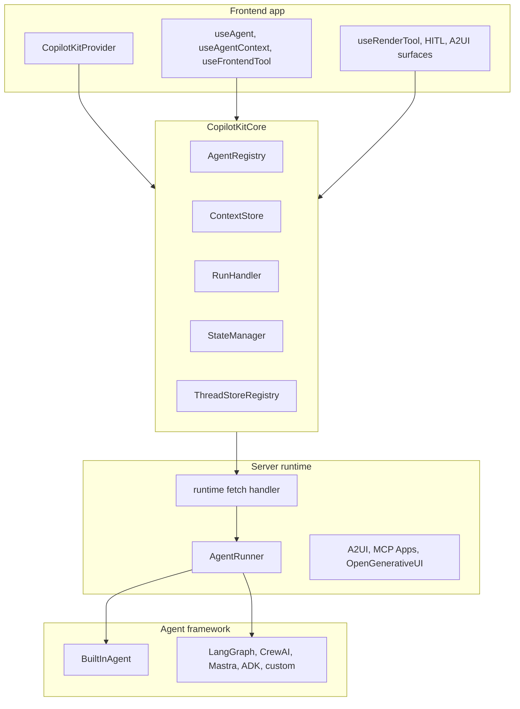

# 1. CopilotKit 소개

CopilotKit을 “채팅창 라이브러리”로 읽으면 핵심이 빠집니다. repo의 중심은 chat component가 아니라 앱, runtime, agent, tool, state, renderer를 하나의 interaction boundary로 묶는 구조입니다.

## 짧은 답

CopilotKit은 앱이 agent에게 context, tools, shared state, renderer, human decision을 열고, agent runtime이 AG-UI event stream으로 결과를 돌려주는 framework입니다. 핵심 객체는 `CopilotKitCore`, `RunHandler`, `AgentRegistry`, `CopilotRuntime`이며, tool result는 UI card에서 끝나는 것이 아니라 agent observation으로 돌아가야 합니다.

정확한 한 문장 정의는 다음입니다.

```text
CopilotKit은 frontend app이 agent에게 context, tools, shared state, renderer, human decision을 열고,
agent runtime이 그 결과를 AG-UI event stream으로 다시 앱에 돌려주는
agent-native application framework다.
```

이 정의는 추상이 아니라 source 구조에서 나옵니다.

| Source | 근거 |
| --- | --- |
| [`packages/core/src/core/core.ts#L36`](https://github.com/nfbs2000/speaky-CopilotKit/blob/5c50d9c51/packages/core/src/core/core.ts#L36) | `CopilotKitCoreConfig`가 runtime URL, transport, headers, credentials, forwarded properties, frontend tools, suggestions, debug를 한 boundary로 묶습니다. |
| [`packages/core/src/core/core.ts#L354`](https://github.com/nfbs2000/speaky-CopilotKit/blob/5c50d9c51/packages/core/src/core/core.ts#L354) | `CopilotKitCore`가 `AgentRegistry`, `ContextStore`, `SuggestionEngine`, `RunHandler`, `StateManager`, `ThreadStoreRegistry`를 생성합니다. |
| [`packages/runtime/src/v2/runtime/core/runtime.ts#L121`](https://github.com/nfbs2000/speaky-CopilotKit/blob/5c50d9c51/packages/runtime/src/v2/runtime/core/runtime.ts#L121) | server runtime option이 agents, runner, middleware, A2UI, MCP Apps, Intelligence mode를 runtime boundary로 묶습니다. |
| [`skills/copilotkit-agui/SKILL.md`](https://github.com/nfbs2000/speaky-CopilotKit/blob/5c50d9c51/skills/copilotkit-agui/SKILL.md) | AG-UI를 lifecycle, text, tool, state, reasoning, activity, custom event stream으로 설명합니다. |

## 세 계층으로 읽기

CopilotKit은 최소 세 계층으로 읽어야 합니다.



Frontend는 React API를 제공합니다. Core는 agent registry, context, tools, state, run execution을 관리합니다. Runtime은 HTTP/SSE boundary에서 agent를 실행하고 AG-UI event를 흘려보냅니다.

## CopilotKitCore는 UI 설정 객체가 아니다

`CopilotKitCoreConfig`를 보면 CopilotKit이 무엇을 boundary로 보는지 드러납니다.

| Config | 의미 |
| --- | --- |
| `runtimeUrl` | frontend가 어느 CopilotRuntime으로 연결될지 정합니다. |
| `runtimeTransport` | REST, single endpoint, auto-detect 같은 transport 선택입니다. |
| `agents__unsafe_dev_only` | 개발 중 local agent를 직접 주입하는 escape hatch입니다. |
| `headers`, `credentials` | runtime request에 붙는 인증/쿠키 경계입니다. |
| `properties` | agent run에 전달되는 forwarded props입니다. |
| `tools` | agent에게 열어주는 frontend tool 목록입니다. |
| `suggestionsConfig` | suggestion surface 설정입니다. |
| `debug` | client-side event pipeline debug입니다. |

이 설정은 “채팅 UI 색상”이 아니라 agent application 실행 경계입니다.

`CopilotKitCore` constructor는 이 config에서 subsystem을 생성합니다.

| Subsystem | 실제 책임 |
| --- | --- |
| `AgentRegistry` | runtime `/info`로 agent 목록과 runtime capability를 발견하고, local/proxied agent를 관리합니다. |
| `ContextStore` | 앱 context를 agent input에 넣기 위해 보관하고 agent scope로 필터링합니다. |
| `SuggestionEngine` | agent별 suggestion lifecycle을 관리합니다. |
| `RunHandler` | agent run, tool execution, tool result message 삽입, follow-up run을 책임집니다. |
| `StateManager` | AG-UI state snapshot/delta와 message/run association을 추적합니다. |
| `ThreadStoreRegistry` | agent별 thread store를 연결하고 subscription을 관리합니다. |

이 중 핵심은 `RunHandler`입니다. CopilotKit에서 tool call이 “보이는 UI”로 끝나지 않고 “agent observation”으로 돌아가는 경로가 여기에 있습니다.

## Frontend가 agent에게 여는 경계

React layer는 다섯 가지 경계를 앱에 제공합니다.

| 경계 | 대표 API | 근거 |
| --- | --- | --- |
| Agent instance | `useAgent` | [`use-agent.tsx#L53`](https://github.com/nfbs2000/speaky-CopilotKit/blob/5c50d9c51/packages/react-core/src/v2/hooks/use-agent.tsx#L53) |
| Context | `useAgentContext` | [`use-agent-context.tsx`](https://github.com/nfbs2000/speaky-CopilotKit/blob/5c50d9c51/packages/react-core/src/v2/hooks/use-agent-context.tsx) |
| Frontend tool | `useFrontendTool` | [`use-frontend-tool.tsx#L7`](https://github.com/nfbs2000/speaky-CopilotKit/blob/5c50d9c51/packages/react-core/src/v2/hooks/use-frontend-tool.tsx#L7) |
| Tool renderer | `useRenderTool` | [`use-render-tool.tsx#L78`](https://github.com/nfbs2000/speaky-CopilotKit/blob/5c50d9c51/packages/react-core/src/v2/hooks/use-render-tool.tsx#L78) |
| Human decision | `useHumanInTheLoop` | [`use-human-in-the-loop.tsx#L20`](https://github.com/nfbs2000/speaky-CopilotKit/blob/5c50d9c51/packages/react-core/src/v2/hooks/use-human-in-the-loop.tsx#L20) |

여기서 중요한 점은 handler와 renderer가 다르다는 것입니다.

`useFrontendTool`은 agent가 호출할 수 있는 capability를 엽니다. tool name, parameters, handler, render, agentId, available 같은 contract를 등록합니다.

`useRenderTool`은 이미 발생한 tool call과 result를 어떻게 보여줄지만 정합니다. renderer는 agent observation을 대체하지 않습니다.

`useHumanInTheLoop`은 사용자의 승인/수정/선택을 promise로 받아 tool result 경로로 돌려줍니다. 즉 사용자 입력도 agent loop 안으로 돌아가야 합니다.

## Runtime은 모델 두뇌가 아니라 실행 경계다

server runtime은 request를 받고, agent를 찾고, middleware를 적용하고, AG-UI event stream을 반환합니다.

| Runtime component | 역할 |
| --- | --- |
| [`CopilotSseRuntime`](https://github.com/nfbs2000/speaky-CopilotKit/blob/5c50d9c51/packages/runtime/src/v2/runtime/core/runtime.ts#L298) | 기본 SSE runtime입니다. |
| [`CopilotIntelligenceRuntime`](https://github.com/nfbs2000/speaky-CopilotKit/blob/5c50d9c51/packages/runtime/src/v2/runtime/core/runtime.ts#L310) | durable thread와 realtime intelligence mode입니다. |
| [`fetch-handler.ts#L300`](https://github.com/nfbs2000/speaky-CopilotKit/blob/5c50d9c51/packages/runtime/src/v2/runtime/core/fetch-handler.ts#L300) | `agent/run`, `agent/connect`, `agent/stop`, `info`, thread endpoint를 dispatch합니다. |
| [`handle-run.ts#L33`](https://github.com/nfbs2000/speaky-CopilotKit/blob/5c50d9c51/packages/runtime/src/v2/runtime/handlers/handle-run.ts#L33) | run request를 parse하고 agent/middleware를 설정한 뒤 SSE 또는 Intelligence path로 보냅니다. |
| [`sse-response.ts#L82`](https://github.com/nfbs2000/speaky-CopilotKit/blob/5c50d9c51/packages/runtime/src/v2/runtime/handlers/shared/sse-response.ts#L82) | observable AG-UI event를 SSE chunk로 encode합니다. |

Runtime은 agent framework 내부의 planner가 아닙니다. Runtime은 agent framework가 만든 event를 CopilotKit frontend가 이해할 수 있는 AG-UI stream으로 전달합니다.

## AG-UI가 언어다

AG-UI는 CopilotKit이 agent와 UI 사이에서 쓰는 event language입니다. event family는 다음과 같습니다.

| Family | 예 | 의미 |
| --- | --- | --- |
| Lifecycle | `RUN_STARTED`, `RUN_FINISHED`, `RUN_ERROR` | run boundary |
| Text | `TEXT_MESSAGE_START`, `TEXT_MESSAGE_CONTENT`, `TEXT_MESSAGE_END` | assistant streaming text |
| Tool | `TOOL_CALL_START`, `TOOL_CALL_ARGS`, `TOOL_CALL_RESULT` | tool lifecycle |
| State | `STATE_SNAPSHOT`, `STATE_DELTA` | shared state |
| Reasoning | reasoning event | 생각/진행 trace |
| Activity | `ACTIVITY_SNAPSHOT`, `ACTIVITY_DELTA` | UI activity/progress |
| Custom | `CUSTOM` | extension point |

CopilotKit이 다양한 agent framework를 붙일 수 있는 이유는 framework 내부가 같아서가 아닙니다. 서로 다른 framework를 AG-UI event stream으로 번역하는 adapter boundary가 있기 때문입니다.

## 이 장의 결론

CopilotKit은 모델을 소유하지 않습니다. CopilotKit은 앱과 agent runtime 사이의 boundary를 소유합니다.

```text
app capability -> CopilotKit registry -> AG-UI agent input -> agent tool call
-> CopilotKit handler/result -> agent observation -> follow-up run -> UI projection
```

Mothership 같은 application runtime에 붙일 때도 이 관점을 유지해야 합니다. CopilotKit은 Mothership의 planning loop를 대체하는 중심이 아니라, Mothership protocol을 AG-UI와 React UI로 투영하는 adapter가 되어야 합니다.
