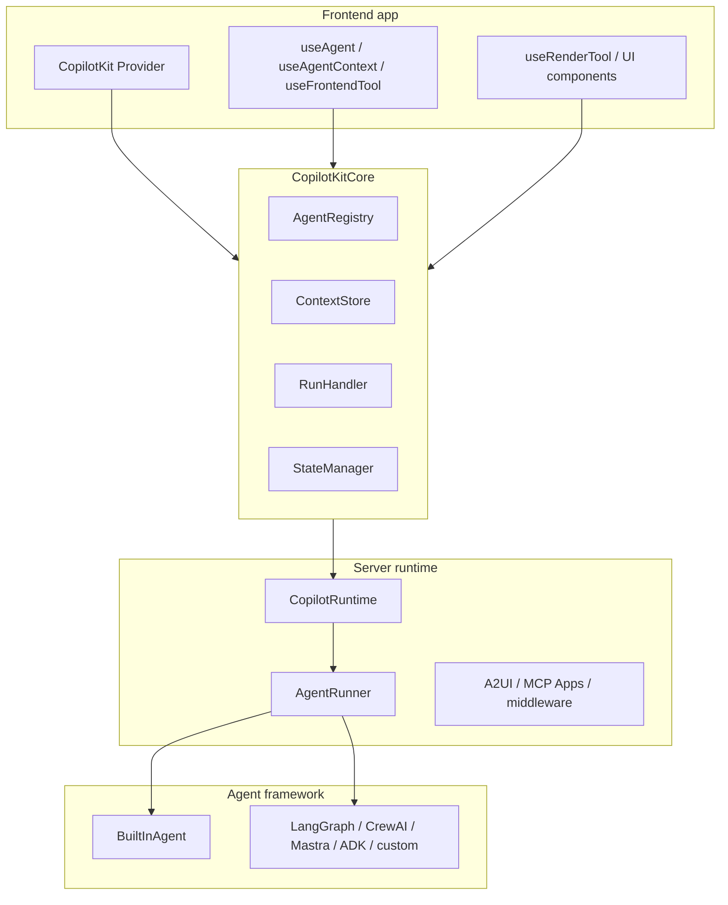

# 1. CopilotKit 소개

CopilotKit을 “앱에 붙이는 채팅창”으로 이해하면 실제 source 구조를 놓칩니다. 이 repo에서 보이는 CopilotKit의 중심은 chat component가 아니라 앱, runtime, agent, tool, state, UI renderer를 하나의 interaction contract로 묶는 구조입니다.

## 한 문장 정의

CopilotKit은 frontend app이 agent에게 읽힐 context, 호출 가능한 tools, 공유 state, UI renderer, human-in-the-loop 결정을 노출하고, agent runtime이 그 결과를 AG-UI event stream으로 다시 앱에 돌려주는 agent-native application framework입니다.

이 정의는 홍보 문구가 아니라 실제 source 구조에서 나옵니다.

| Source | 근거 |
| --- | --- |
| [`README.md`](https://github.com/nfbs2000/speaky-CopilotKit/blob/5c50d9c51/README.md) | agent-native applications, generative UI, shared state, human-in-the-loop workflows를 핵심 기능으로 설명합니다. |
| [`packages/core/src/core/core.ts`](https://github.com/nfbs2000/speaky-CopilotKit/blob/5c50d9c51/packages/core/src/core/core.ts#L36) | `CopilotKitCoreConfig`가 runtime URL, headers, credentials, forwarded properties, frontend tools, suggestions, debug를 한 설정으로 묶습니다. |
| [`packages/core/src/core/core.ts`](https://github.com/nfbs2000/speaky-CopilotKit/blob/5c50d9c51/packages/core/src/core/core.ts#L354) | `CopilotKitCore`가 `AgentRegistry`, `ContextStore`, `RunHandler`, `StateManager`, `ThreadStoreRegistry`를 생성합니다. |
| [`packages/runtime/src/v2/runtime/core/runtime.ts`](https://github.com/nfbs2000/speaky-CopilotKit/blob/5c50d9c51/packages/runtime/src/v2/runtime/core/runtime.ts#L121) | `CopilotRuntime` option이 agents, runner, middleware, A2UI, MCP Apps, Intelligence mode를 runtime boundary로 묶습니다. |
| [`skills/copilotkit-agui/SKILL.md`](https://github.com/nfbs2000/speaky-CopilotKit/blob/5c50d9c51/skills/copilotkit-agui/SKILL.md) | AG-UI event family와 SSE wire format을 agent-to-UI communication contract로 설명합니다. |

## 왜 챗봇 UI가 아닌가

CopilotKit에는 chat UI가 있습니다. 하지만 chat UI는 표면 중 하나입니다. 실제 core는 다음 질문에 답합니다.

```text
앱은 어떤 상태를 agent에게 읽힐 것인가?
agent는 어떤 앱 기능을 호출할 수 있는가?
tool result는 어디에 들어가고 누가 다시 읽는가?
상태 변화는 어떤 thread/run에 속하는가?
사용자의 승인/수정은 어떻게 agent loop로 돌아가는가?
```

이 질문은 UI component만으로 해결되지 않습니다. 그래서 CopilotKit은 세 계층으로 읽어야 합니다.



## Core가 보여주는 실제 책임

`CopilotKitCoreConfig`는 UI 테마 설정이 아닙니다. agent-native 앱을 실행하기 위한 boundary 설정입니다.

| 설정 | 의미 |
| --- | --- |
| `runtimeUrl` | frontend가 어느 CopilotRuntime으로 갈지 정합니다. |
| `runtimeTransport` | REST, single endpoint, auto 같은 runtime transport를 정합니다. |
| `agents__unsafe_dev_only` | 개발 중 local agent를 직접 넣는 escape hatch입니다. |
| `headers`, `credentials` | runtime request에 붙는 인증/쿠키 경계입니다. |
| `properties` | AG-UI agent로 전달할 forwarded props입니다. |
| `tools` | agent에게 열어줄 frontend tool 목록입니다. |
| `suggestionsConfig` | suggestion surface를 구성합니다. |
| `debug` | client-side event pipeline debug를 켭니다. |

`CopilotKitCore` constructor는 이 설정을 받아 subsystem을 초기화합니다.

| Subsystem | 역할 |
| --- | --- |
| `AgentRegistry` | 어떤 agent가 있고 runtime으로 어떻게 연결되는지 관리합니다. |
| `ContextStore` | app state/context를 agent input으로 전달할 준비를 합니다. |
| `SuggestionEngine` | agent별 suggestion을 관리합니다. |
| `RunHandler` | agent run, frontend tool execution, follow-up run을 처리합니다. |
| `StateManager` | agent state snapshot/delta를 관리합니다. |
| `ThreadStoreRegistry` | agent별 thread store를 연결합니다. |

이 구조 때문에 CopilotKit은 chat bubble library보다 runtime surface에 가깝습니다.

## Frontend가 agent에게 여는 다섯 가지 경계

| 경계 | 대표 API | source |
| --- | --- | --- |
| Agent instance | `useAgent` | [`packages/react-core/src/v2/hooks/use-agent.tsx`](https://github.com/nfbs2000/speaky-CopilotKit/blob/5c50d9c51/packages/react-core/src/v2/hooks/use-agent.tsx) |
| Context | `useAgentContext` | [`packages/react-core/src/v2/hooks/use-agent-context.tsx`](https://github.com/nfbs2000/speaky-CopilotKit/blob/5c50d9c51/packages/react-core/src/v2/hooks/use-agent-context.tsx) |
| Frontend tool | `useFrontendTool` | [`packages/react-core/src/v2/hooks/use-frontend-tool.tsx`](https://github.com/nfbs2000/speaky-CopilotKit/blob/5c50d9c51/packages/react-core/src/v2/hooks/use-frontend-tool.tsx) |
| Tool renderer | `useRenderTool` | [`packages/react-core/src/v2/hooks/use-render-tool.tsx`](https://github.com/nfbs2000/speaky-CopilotKit/blob/5c50d9c51/packages/react-core/src/v2/hooks/use-render-tool.tsx) |
| Human decision | `useHumanInTheLoop` | [`packages/react-core/src/v2/hooks/use-human-in-the-loop.tsx`](https://github.com/nfbs2000/speaky-CopilotKit/blob/5c50d9c51/packages/react-core/src/v2/hooks/use-human-in-the-loop.tsx) |

`useAgent`는 단순 hook이 아닙니다. runtime이 아직 연결 중이면 `ProxiedCopilotRuntimeAgent`를 만들고, runtime connection status와 thread id를 맞추며, messages/state/run status update에 subscribe합니다.

`useFrontendTool`은 tool을 등록합니다. 이때 tool은 name, parameters, handler, render, agentId, available 같은 capability boundary를 가집니다. 모델이 임의로 앱을 조작하는 게 아니라, 앱이 등록한 tool surface 안에서만 호출이 가능합니다.

`useRenderTool`은 renderer를 등록합니다. 이 hook은 tool call을 어떻게 보여줄지 정하지만, tool execution 그 자체를 소유하지 않습니다. 이 구분이 중요합니다.

`useHumanInTheLoop`은 frontend tool과 renderer를 결합해 사용자의 응답을 promise로 돌려주는 구조입니다. 사용자의 승인/수정은 UI에서 끝나는 것이 아니라 agent run의 observation으로 돌아가야 합니다.

## Runtime은 무엇을 책임지는가

`CopilotRuntime`은 server-side boundary입니다. source에서 `CopilotRuntimeOptions`는 다음을 포함합니다.

| Runtime option | 의미 |
| --- | --- |
| `agents` | runtime이 노출할 agent map 또는 per-request factory입니다. |
| `runner` | agent execution strategy입니다. 기본은 `InMemoryAgentRunner`입니다. |
| `intelligence` | durable thread와 realtime event를 위한 Intelligence mode입니다. |
| `beforeRequestMiddleware`, `afterRequestMiddleware` | auth, logging, rate limit 같은 cross-cutting boundary입니다. |
| `a2ui` | A2UI middleware를 agent run에 적용할 수 있게 합니다. |
| `mcpApps` | MCP Apps middleware를 agent에 붙입니다. |
| `openGenerativeUI` | open-ended generative UI surface입니다. |

`CopilotRuntime` class는 compatibility shim입니다. source에서는 options에 `intelligence`가 있으면 `CopilotIntelligenceRuntime`, 없으면 `CopilotSseRuntime`으로 delegate합니다.

## Agent communication은 AG-UI다

CopilotKit과 agent framework의 wire contract는 AG-UI입니다. AG-UI event family는 다음처럼 나뉩니다.

| Family | 대표 event | 의미 |
| --- | --- | --- |
| Lifecycle | `RUN_STARTED`, `RUN_FINISHED`, `RUN_ERROR` | run boundary |
| Text | `TEXT_MESSAGE_START`, `TEXT_MESSAGE_CONTENT`, `TEXT_MESSAGE_END` | streaming assistant text |
| Tool | `TOOL_CALL_START`, `TOOL_CALL_ARGS`, `TOOL_CALL_RESULT` | agent tool lifecycle |
| State | `STATE_SNAPSHOT`, `STATE_DELTA` | shared state |
| Activity | `ACTIVITY_SNAPSHOT`, `ACTIVITY_DELTA` | progress/activity |
| Custom | `RAW`, `CUSTOM` | extension point |

CopilotKit이 다양한 framework를 붙일 수 있는 이유는 framework별 내부가 같아서가 아닙니다. LangGraph, CrewAI, Mastra, ADK, MCP Apps를 AG-UI event로 번역하는 adapter pattern을 쓰기 때문입니다.

## 이 Pages의 관점

이 Pages는 CopilotKit을 다음 문장으로 고정합니다.

```text
CopilotKit은 모델의 두뇌가 아니라 앱과 agent runtime 사이의 interaction boundary다.
앱은 CopilotKit으로 capability surface를 열고,
agent는 AG-UI를 통해 그 surface를 호출하며,
CopilotKit은 result, renderer, state, follow-up run을 연결한다.
```

따라서 CopilotKit을 Mothership에 붙일 때도 중심은 CopilotKit tool card가 아닙니다. 중심은 Mothership/OpenCode/agent loop이고, CopilotKit은 그 loop를 사용자가 볼 수 있는 UI/protocol surface로 투영해야 합니다.

## 다음 장

다음 장에서는 이 정의가 repo 안에서 어떤 package와 directory로 나뉘는지 source map으로 정리합니다.
