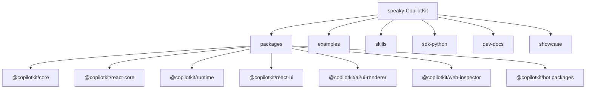
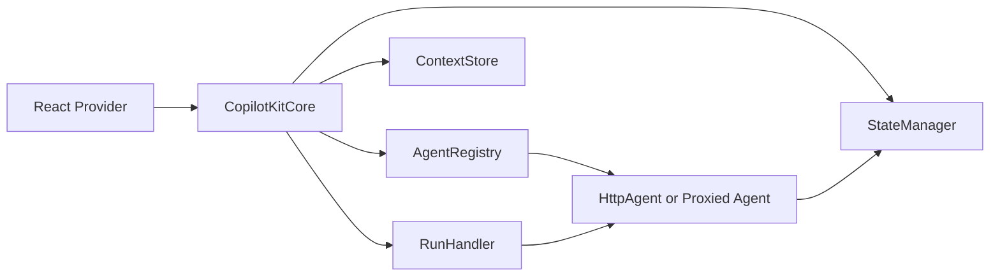
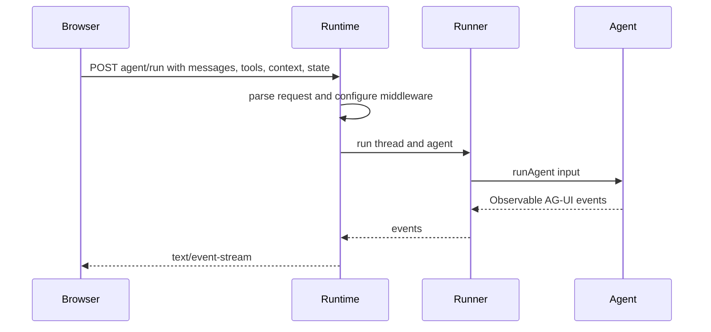

# 2. CopilotKit Monorepo 지도

CopilotKit을 제대로 읽으려면 package 경계를 먼저 봐야 합니다. 이 repo는 단일 React widget이 아니라 frontend core, React hooks, runtime, AG-UI adapter, A2UI renderer, examples, docs, bot surface가 같이 있는 monorepo입니다.

## 전체 구조

## package별 책임

| Package | 책임 | Source |
| --- | --- | --- |
| `@copilotkit/core` | agent registry, context store, run handler, state manager를 가진 client-side orchestration core | [`packages/core/src`](https://github.com/nfbs2000/speaky-CopilotKit/tree/5c50d9c51/packages/core/src) |
| `@copilotkit/react-core` | React Provider, hooks, chat integration, A2UI/MCP Apps renderer bridge | [`packages/react-core/src`](https://github.com/nfbs2000/speaky-CopilotKit/tree/5c50d9c51/packages/react-core/src) |
| `@copilotkit/react-ui` | Chat, popup, sidebar 등 ready-made UI surface | [`packages/react-ui/src`](https://github.com/nfbs2000/speaky-CopilotKit/tree/5c50d9c51/packages/react-ui/src) |
| `@copilotkit/runtime` | server runtime, agent runner, built-in agent, fetch handlers | [`packages/runtime/src`](https://github.com/nfbs2000/speaky-CopilotKit/tree/5c50d9c51/packages/runtime/src) |
| `@copilotkit/sdk-js` | JavaScript/TypeScript agent integration helper | [`packages/sdk-js/src`](https://github.com/nfbs2000/speaky-CopilotKit/tree/5c50d9c51/packages/sdk-js/src) |
| `sdk-python` | Python integrations and AG-UI compatible tests | [`sdk-python`](https://github.com/nfbs2000/speaky-CopilotKit/tree/5c50d9c51/sdk-python) |
| `@copilotkit/a2ui-renderer` | A2UI declarative surface renderer와 catalog extraction | [`packages/a2ui-renderer/src`](https://github.com/nfbs2000/speaky-CopilotKit/tree/5c50d9c51/packages/a2ui-renderer/src) |
| `@copilotkit/web-inspector` | AG-UI/event debugging inspector | [`packages/web-inspector/src`](https://github.com/nfbs2000/speaky-CopilotKit/tree/5c50d9c51/packages/web-inspector/src) |

## Core package 읽기

`packages/core`는 CopilotKit의 client-side 실행 중심입니다.

| 파일 | 봐야 할 지점 |
| --- | --- |
| [`core.ts`](https://github.com/nfbs2000/speaky-CopilotKit/blob/5c50d9c51/packages/core/src/core/core.ts) | `CopilotKitCoreConfig`, subsystem 생성, subscriber, runtime connection status |
| [`agent-registry.ts`](https://github.com/nfbs2000/speaky-CopilotKit/blob/5c50d9c51/packages/core/src/core/agent-registry.ts) | local/remote/proxied agent, runtime `/info`, transport auto-detect |
| [`context-store.ts`](https://github.com/nfbs2000/speaky-CopilotKit/blob/5c50d9c51/packages/core/src/core/context-store.ts) | agent scope가 있는 app context 저장과 필터링 |
| [`run-handler.ts`](https://github.com/nfbs2000/speaky-CopilotKit/blob/5c50d9c51/packages/core/src/core/run-handler.ts) | `runAgent`, frontend tool execution, tool result message 삽입, follow-up |
| [`state-manager.ts`](https://github.com/nfbs2000/speaky-CopilotKit/blob/5c50d9c51/packages/core/src/core/state-manager.ts) | AG-UI state snapshot/delta와 run/message association |

Core의 흐름은 다음처럼 읽으면 됩니다.

## React layer 읽기

`packages/react-core`는 앱 개발자가 직접 만지는 layer입니다.

| API | 소스 | 실제 의미 |
| --- | --- | --- |
| `CopilotKitProvider` | [`CopilotKitProvider.tsx`](https://github.com/nfbs2000/speaky-CopilotKit/blob/5c50d9c51/packages/react-core/src/v2/providers/CopilotKitProvider.tsx) | core instance 생성, runtime URL/headers/properties sync, tools/renderers/A2UI context 구성 |
| `useAgent` | [`use-agent.tsx`](https://github.com/nfbs2000/speaky-CopilotKit/blob/5c50d9c51/packages/react-core/src/v2/hooks/use-agent.tsx) | agent instance, messages, state, run status를 React state로 연결 |
| `useFrontendTool` | [`use-frontend-tool.tsx`](https://github.com/nfbs2000/speaky-CopilotKit/blob/5c50d9c51/packages/react-core/src/v2/hooks/use-frontend-tool.tsx) | agent가 호출할 수 있는 frontend capability 등록 |
| `useRenderTool` | [`use-render-tool.tsx`](https://github.com/nfbs2000/speaky-CopilotKit/blob/5c50d9c51/packages/react-core/src/v2/hooks/use-render-tool.tsx) | tool call/result 표시 방식만 등록 |
| `useHumanInTheLoop` | [`use-human-in-the-loop.tsx`](https://github.com/nfbs2000/speaky-CopilotKit/blob/5c50d9c51/packages/react-core/src/v2/hooks/use-human-in-the-loop.tsx) | 사용자 응답을 tool result로 되돌리는 interaction tool |
| A2UI renderer | [`A2UIMessageRenderer.tsx`](https://github.com/nfbs2000/speaky-CopilotKit/blob/5c50d9c51/packages/react-core/src/v2/a2ui/A2UIMessageRenderer.tsx) | `a2ui_operations` activity를 React surface로 처리 |

`CopilotKitProvider`에서 특히 봐야 할 부분은 세 가지입니다.

1. source의 props가 runtime, agents, tools, renderers, HITL, A2UI, OpenGenerativeUI를 모두 받습니다.
2. provider는 child hooks에서 등록한 tool을 덮어쓰지 않도록 첫 setter effect를 건너뜁니다.
3. A2UI가 활성화되면 built-in A2UI message renderer와 catalog context를 provider tree에 붙입니다.

## Runtime layer 읽기

`packages/runtime`은 server boundary입니다.

| 파일 | 역할 |
| --- | --- |
| [`core/runtime.ts`](https://github.com/nfbs2000/speaky-CopilotKit/blob/5c50d9c51/packages/runtime/src/v2/runtime/core/runtime.ts) | `CopilotSseRuntime`, `CopilotIntelligenceRuntime`, compatibility `CopilotRuntime` |
| [`core/fetch-handler.ts`](https://github.com/nfbs2000/speaky-CopilotKit/blob/5c50d9c51/packages/runtime/src/v2/runtime/core/fetch-handler.ts) | CORS, middleware, route dispatch, single endpoint support |
| [`handlers/get-runtime-info.ts`](https://github.com/nfbs2000/speaky-CopilotKit/blob/5c50d9c51/packages/runtime/src/v2/runtime/handlers/get-runtime-info.ts) | `/info` response, agent list, A2UI capability, license/runtime mode |
| [`handlers/handle-run.ts`](https://github.com/nfbs2000/speaky-CopilotKit/blob/5c50d9c51/packages/runtime/src/v2/runtime/handlers/handle-run.ts) | run request parse, agent clone/configure, SSE or Intelligence path |
| [`runner/in-memory.ts`](https://github.com/nfbs2000/speaky-CopilotKit/blob/5c50d9c51/packages/runtime/src/v2/runtime/runner/in-memory.ts) | active run store, concurrent run guard, connect replay, thread event/state history |

Runtime은 model SDK wrapper로만 보면 부족합니다. Runtime은 AG-UI endpoint surface입니다.

## A2UI와 OpenGenerativeUI 위치

CopilotKit에는 두 가지 UI 생성 경로가 보입니다.

| 경로 | 소스 | 의미 |
| --- | --- | --- |
| A2UI | [`packages/react-core/src/v2/a2ui`](https://github.com/nfbs2000/speaky-CopilotKit/tree/5c50d9c51/packages/react-core/src/v2/a2ui), [`packages/a2ui-renderer`](https://github.com/nfbs2000/speaky-CopilotKit/tree/5c50d9c51/packages/a2ui-renderer) | catalog 기반 declarative UI surface를 agent가 조작합니다. |
| OpenGenerativeUI | [`open-generative-ui-middleware.ts`](https://github.com/nfbs2000/speaky-CopilotKit/blob/5c50d9c51/packages/runtime/src/v2/runtime/open-generative-ui-middleware.ts) | `generateSandboxedUi` tool args를 activity event로 바꿔 streaming UI generation을 투영합니다. |

A2UI는 “모델이 React를 직접 작성한다”가 아닙니다. provider가 A2UI catalog를 주고, runtime middleware와 client renderer가 operation stream을 처리합니다.

## AG-UI 문서 위치

AG-UI는 repo 안에서 여러 곳에 설명되어 있습니다.

| 위치 | 읽을 내용 |
| --- | --- |
| [`skills/copilotkit-agui/SKILL.md`](https://github.com/nfbs2000/speaky-CopilotKit/blob/5c50d9c51/skills/copilotkit-agui/SKILL.md) | event family, SSE format, tool call, state sync, interrupt/resume rule |
| [`dev-docs/architecture/ARCHITECTURE.md`](https://github.com/nfbs2000/speaky-CopilotKit/blob/5c50d9c51/dev-docs/architecture/ARCHITECTURE.md) | frontend, runtime, agent architecture |
| [`showcase/shell-docs/src/content/ag-ui/concepts/architecture.mdx`](https://github.com/nfbs2000/speaky-CopilotKit/blob/5c50d9c51/showcase/shell-docs/src/content/ag-ui/concepts/architecture.mdx) | `run(input) -> Observable<BaseEvent>` 관점의 AG-UI 설명 |
| [`showcase/shell-docs/src/content/ag-ui/concepts/tools.mdx`](https://github.com/nfbs2000/speaky-CopilotKit/blob/5c50d9c51/showcase/shell-docs/src/content/ag-ui/concepts/tools.mdx) | frontend-defined tools와 tool lifecycle |

## Examples는 product flow로 읽기

`examples/showcases`는 기능 데모라기보다 product flow reference로 읽는 게 좋습니다.

| Example | 읽을 관점 |
| --- | --- |
| [`generative-ui-playground`](https://github.com/nfbs2000/speaky-CopilotKit/tree/5c50d9c51/examples/showcases/generative-ui-playground) | generative UI와 tool rendering |
| [`research-canvas`](https://github.com/nfbs2000/speaky-CopilotKit/tree/5c50d9c51/examples/showcases/research-canvas) | canvas형 agent-native UI |
| [`mcp-apps`](https://github.com/nfbs2000/speaky-CopilotKit/tree/5c50d9c51/examples/showcases/mcp-apps) | MCP Apps middleware와 UI bridge |
| [`langgraph-js-support-agents`](https://github.com/nfbs2000/speaky-CopilotKit/tree/5c50d9c51/examples/showcases/langgraph-js-support-agents) | LangGraph agent를 AG-UI로 붙이는 방식 |
| [`adk-dashboard`](https://github.com/nfbs2000/speaky-CopilotKit/tree/5c50d9c51/examples/showcases/adk-dashboard) | dashboard application과 agent event stream 결합 |

## 읽는 순서

실제 분석 순서는 다음이 좋습니다.

1. `packages/core/src/core/core.ts`에서 subsystem을 봅니다.
2. `packages/core/src/core/run-handler.ts`에서 tool result와 follow-up을 봅니다.
3. `packages/react-core/src/v2/providers/CopilotKitProvider.tsx`에서 provider가 무엇을 합치는지 봅니다.
4. `packages/react-core/src/v2/hooks`에서 앱 API의 의미를 봅니다.
5. `packages/runtime/src/v2/runtime`에서 server endpoint와 event stream을 봅니다.
6. `skills/copilotkit-agui`와 `showcase/shell-docs`에서 AG-UI event language를 봅니다.
7. `examples/showcases`에서 product flow를 봅니다.

이 순서로 보면 CopilotKit은 React chat package가 아니라 “agent application을 만들기 위한 protocol runtime과 UI integration kit”으로 보입니다.
