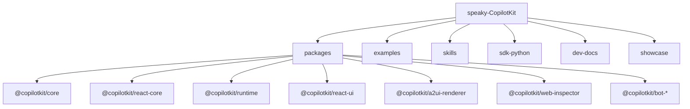

# 2. CopilotKit Monorepo 지도

CopilotKit을 이해하려면 README보다 먼저 package 경계를 봐야 합니다. 이 repo는 단일 React package가 아니라 frontend, runtime, protocol adapter, UI renderer, platform bot, example을 함께 가진 monorepo입니다.

## 큰 구조

## 주요 package 역할

| Package | 역할 | Source |
| --- | --- | --- |
| `@copilotkit/core` | agent registry, context store, run handler, state manager를 가진 frontend orchestration core | [`packages/core/src`](https://github.com/nfbs2000/speaky-CopilotKit/tree/5c50d9c51/packages/core/src) |
| `@copilotkit/react-core` | React Provider, hooks, chat integration, A2UI/MCP Apps renderer bridge | [`packages/react-core/src`](https://github.com/nfbs2000/speaky-CopilotKit/tree/5c50d9c51/packages/react-core/src) |
| `@copilotkit/react-ui` | Chat, popup, sidebar 같은 React UI surface | [`packages/react-ui/src`](https://github.com/nfbs2000/speaky-CopilotKit/tree/5c50d9c51/packages/react-ui/src) |
| `@copilotkit/runtime` | server runtime, agent runner, built-in agent, Hono/Express handler | [`packages/runtime/src`](https://github.com/nfbs2000/speaky-CopilotKit/tree/5c50d9c51/packages/runtime/src) |
| `@copilotkit/sdk-js` | JavaScript/TypeScript agent framework integration helpers | [`packages/sdk-js/src`](https://github.com/nfbs2000/speaky-CopilotKit/tree/5c50d9c51/packages/sdk-js/src) |
| `sdk-python` | Python integrations and AG-UI compatible SDK tests | [`sdk-python`](https://github.com/nfbs2000/speaky-CopilotKit/tree/5c50d9c51/sdk-python) |
| `@copilotkit/a2ui-renderer` | A2UI declarative surface renderer | [`packages/a2ui-renderer/src`](https://github.com/nfbs2000/speaky-CopilotKit/tree/5c50d9c51/packages/a2ui-renderer/src) |
| `@copilotkit/web-inspector` | AG-UI/event debugging inspector | [`packages/web-inspector/src`](https://github.com/nfbs2000/speaky-CopilotKit/tree/5c50d9c51/packages/web-inspector/src) |
| `@copilotkit/bot-*` | Slack, Teams, Discord, Telegram, WhatsApp 등 browser 밖 surface | [`packages/bot`](https://github.com/nfbs2000/speaky-CopilotKit/tree/5c50d9c51/packages/bot) |

## Core layer

`packages/core`는 CopilotKit의 client-side execution core입니다.

| 파일 | 읽을 내용 |
| --- | --- |
| [`core.ts`](https://github.com/nfbs2000/speaky-CopilotKit/blob/5c50d9c51/packages/core/src/core/core.ts) | `CopilotKitCoreConfig`, subsystem 생성, subscriber, runtime connection status |
| [`run-handler.ts`](https://github.com/nfbs2000/speaky-CopilotKit/blob/5c50d9c51/packages/core/src/core/run-handler.ts) | agent run, frontend tool execution, tool result message 삽입, follow-up run |
| [`context-store.ts`](https://github.com/nfbs2000/speaky-CopilotKit/blob/5c50d9c51/packages/core/src/core/context-store.ts) | app context를 agent에게 읽히는 입력으로 관리 |
| [`state-manager.ts`](https://github.com/nfbs2000/speaky-CopilotKit/blob/5c50d9c51/packages/core/src/core/state-manager.ts) | agent state snapshot/delta 관리 |
| [`agent-registry.ts`](https://github.com/nfbs2000/speaky-CopilotKit/blob/5c50d9c51/packages/core/src/core/agent-registry.ts) | agent 등록, runtime URL, transport 관리 |

핵심은 `RunHandler`입니다. agent가 assistant tool call을 내면 CopilotKit은 등록된 frontend tool을 찾고, handler를 실행하고, result를 `role: "tool"` message로 agent messages에 삽입합니다. 그리고 `followUp !== false`이면 다시 agent run을 이어갑니다.

## React layer

`packages/react-core`는 React 앱이 CopilotKit core를 사용하는 표면입니다.

| API | 역할 | Source |
| --- | --- | --- |
| `CopilotKitProvider` | core 생성, runtime 연결, provider-level 설정 | [`CopilotKitProvider.tsx`](https://github.com/nfbs2000/speaky-CopilotKit/blob/5c50d9c51/packages/react-core/src/v2/providers/CopilotKitProvider.tsx) |
| `useAgent` | agent instance를 얻고 messages/state/run status update에 subscribe | [`use-agent.tsx`](https://github.com/nfbs2000/speaky-CopilotKit/blob/5c50d9c51/packages/react-core/src/v2/hooks/use-agent.tsx) |
| `useAgentContext` | 앱 상태를 agent input context로 등록 | [`use-agent-context.tsx`](https://github.com/nfbs2000/speaky-CopilotKit/blob/5c50d9c51/packages/react-core/src/v2/hooks/use-agent-context.tsx) |
| `useFrontendTool` | browser/app-side tool handler와 optional renderer 등록 | [`use-frontend-tool.tsx`](https://github.com/nfbs2000/speaky-CopilotKit/blob/5c50d9c51/packages/react-core/src/v2/hooks/use-frontend-tool.tsx) |
| `useRenderTool` | tool call renderer만 등록 | [`use-render-tool.tsx`](https://github.com/nfbs2000/speaky-CopilotKit/blob/5c50d9c51/packages/react-core/src/v2/hooks/use-render-tool.tsx) |
| `useHumanInTheLoop` | 사용자의 응답을 promise로 받아 tool result로 돌려주는 HITL hook | [`use-human-in-the-loop.tsx`](https://github.com/nfbs2000/speaky-CopilotKit/blob/5c50d9c51/packages/react-core/src/v2/hooks/use-human-in-the-loop.tsx) |

React layer에서 가장 중요한 구분은 `useFrontendTool`과 `useRenderTool`입니다.

| Hook | handler를 등록하는가 | renderer를 등록하는가 | 의미 |
| --- | --- | --- | --- |
| `useFrontendTool` | 예 | 선택 가능 | agent가 호출할 앱 기능을 엽니다. |
| `useRenderTool` | 아니오 | 예 | 이미 발생한 tool call/result를 어떻게 보여줄지 정합니다. |
| `useHumanInTheLoop` | 예 | 예 | 사용자 승인/수정 입력을 tool result로 돌려줍니다. |

## Runtime layer

`packages/runtime`은 server-side runtime입니다.

| 개념 | Source | 의미 |
| --- | --- | --- |
| `CopilotRuntime` | [`runtime.ts`](https://github.com/nfbs2000/speaky-CopilotKit/blob/5c50d9c51/packages/runtime/src/v2/runtime/core/runtime.ts#L388) | legacy entrypoint compatibility shim |
| `CopilotSseRuntime` | [`runtime.ts`](https://github.com/nfbs2000/speaky-CopilotKit/blob/5c50d9c51/packages/runtime/src/v2/runtime/core/runtime.ts#L298) | 기본 SSE runtime |
| `CopilotIntelligenceRuntime` | [`runtime.ts`](https://github.com/nfbs2000/speaky-CopilotKit/blob/5c50d9c51/packages/runtime/src/v2/runtime/core/runtime.ts#L310) | durable thread/realtime Intelligence runtime |
| `AgentRunner` | [`runner`](https://github.com/nfbs2000/speaky-CopilotKit/tree/5c50d9c51/packages/runtime/src/v2/runtime/runner) | agent execution strategy |
| `BuiltInAgent` | [`agent`](https://github.com/nfbs2000/speaky-CopilotKit/tree/5c50d9c51/packages/runtime/src/agent) | Vercel AI SDK 기반 ready-to-use agent |

Runtime은 모델을 직접 “통제”하는 두뇌가 아닙니다. Runtime은 request를 받고, agent runner를 호출하고, AG-UI events를 frontend로 stream하며, middleware를 적용하는 server boundary입니다.

## AG-UI와 skills

이 repo에는 agent가 CopilotKit과 어떻게 통신해야 하는지 설명하는 skill 문서가 들어 있습니다.

| Skill | 역할 |
| --- | --- |
| [`skills/copilotkit-agui`](https://github.com/nfbs2000/speaky-CopilotKit/tree/5c50d9c51/skills/copilotkit-agui) | AG-UI event type, SSE, `AbstractAgent`, `HttpAgent`, tool call, state sync, interrupt/resume |
| [`skills/copilotkit-setup`](https://github.com/nfbs2000/speaky-CopilotKit/tree/5c50d9c51/skills/copilotkit-setup) | app/runtime setup, provider, endpoint architecture |
| [`skills/copilotkit-integrations`](https://github.com/nfbs2000/speaky-CopilotKit/tree/5c50d9c51/skills/copilotkit-integrations) | LangGraph, CrewAI, Mastra, ADK, MCP Apps 같은 framework integration |
| [`skills/a2ui-renderer`](https://github.com/nfbs2000/speaky-CopilotKit/tree/5c50d9c51/skills/a2ui-renderer) | A2UI renderer 설정과 runtime/client 양쪽 enable rule |

이 skill들은 단순 내부 문서가 아닙니다. 실제로 CopilotKit을 agent coding environment에 설치해 쓰기 위한 운영 지식입니다.

## Examples와 showcases

실제 제품 흐름은 `examples/showcases`에서 확인할 수 있습니다.

| Example | 읽을 관점 |
| --- | --- |
| [`generative-ui-playground`](https://github.com/nfbs2000/speaky-CopilotKit/tree/5c50d9c51/examples/showcases/generative-ui-playground) | generative UI를 도구/렌더러 관점에서 확인 |
| [`research-canvas`](https://github.com/nfbs2000/speaky-CopilotKit/tree/5c50d9c51/examples/showcases/research-canvas) | agent-native product flow |
| [`mcp-apps`](https://github.com/nfbs2000/speaky-CopilotKit/tree/5c50d9c51/examples/showcases/mcp-apps) | MCP Apps middleware와 UI rendering |
| [`langgraph-js-support-agents`](https://github.com/nfbs2000/speaky-CopilotKit/tree/5c50d9c51/examples/showcases/langgraph-js-support-agents) | LangGraph JS integration |
| [`adk-dashboard`](https://github.com/nfbs2000/speaky-CopilotKit/tree/5c50d9c51/examples/showcases/adk-dashboard) | ADK dashboard integration |

## 이 repo를 읽는 좋은 순서

1. `README.md`로 product framing을 잡습니다.
2. `dev-docs/architecture/ARCHITECTURE.md`로 three-layer model을 봅니다.
3. `packages/core/src/core/core.ts`에서 core subsystem을 확인합니다.
4. `packages/core/src/core/run-handler.ts`에서 tool execution과 follow-up을 봅니다.
5. `packages/react-core/src/v2/hooks`에서 frontend API를 봅니다.
6. `packages/runtime/src/v2/runtime`에서 server runtime boundary를 봅니다.
7. `skills/copilotkit-agui`에서 AG-UI event language를 봅니다.
8. `examples/showcases`에서 실제 product flow를 봅니다.

이 순서로 보면 CopilotKit은 “채팅 UI package”가 아니라 “agent-native app을 만들기 위한 runtime + protocol + UI integration kit”으로 보입니다.
