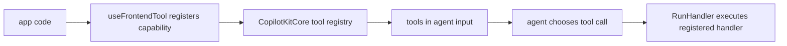
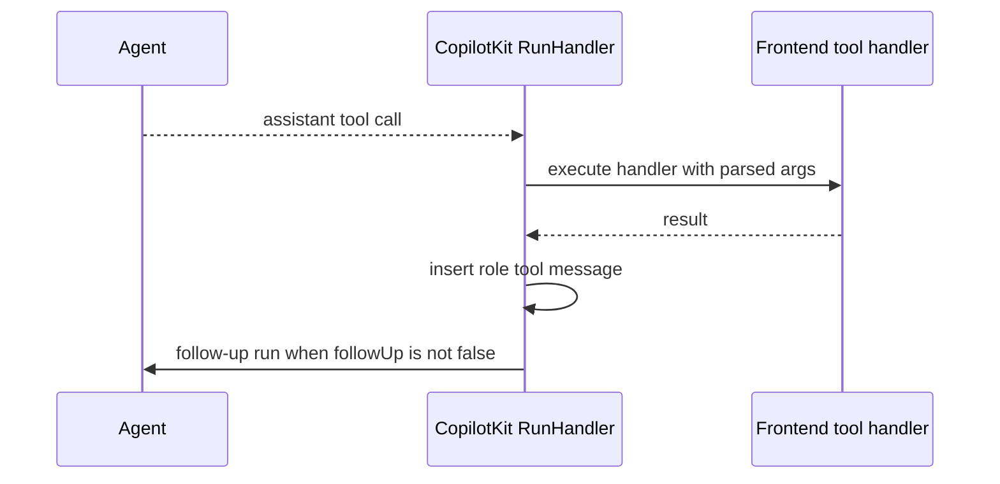
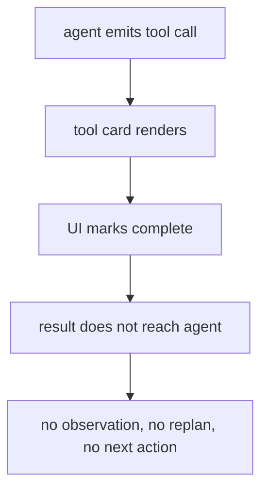
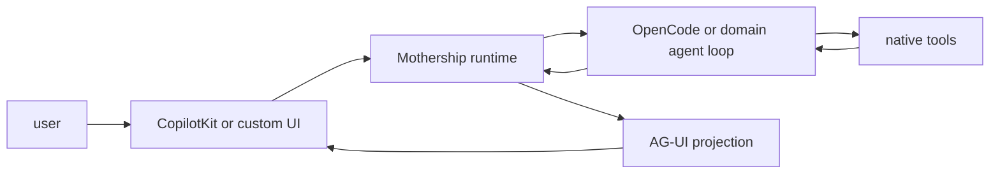

# 3. 모델과 CopilotKit의 통제 경계

질문은 이것입니다.

> CopilotKit이 모델을 통제하는가? 아니면 모델이 CopilotKit을 통제하는가?

## 짧은 답

둘 다 아닙니다. 앱은 CopilotKit으로 capability boundary를 열고, 모델 또는 agent는 그 boundary 안에서 tool call을 선택합니다. CopilotKit은 handler 실행, renderer 표시, tool result message 삽입, follow-up run을 연결합니다. domain runtime은 observation을 읽고 다음 action을 결정합니다.

정확한 답은 다음입니다.

```text
앱은 CopilotKit으로 capability boundary를 등록한다.
모델 또는 agent는 그 boundary 안에서 tool call을 선택한다.
CopilotKit은 tool call, handler, renderer, result, follow-up run을 연결한다.
domain runtime은 tool observation 이후 다음 action을 결정한다.
```

## 통제 관계를 분해하기

| 질문 | 책임 주체 | Source |
| --- | --- | --- |
| 어떤 agent가 있는가 | `AgentRegistry`, runtime `/info` | [`agent-registry.ts#L381`](https://github.com/nfbs2000/speaky-CopilotKit/blob/5c50d9c51/packages/core/src/core/agent-registry.ts#L381), [`get-runtime-info.ts#L37`](https://github.com/nfbs2000/speaky-CopilotKit/blob/5c50d9c51/packages/runtime/src/v2/runtime/handlers/get-runtime-info.ts#L37) |
| 어떤 context가 agent에게 보이는가 | `ContextStore`, `useAgentContext` | [`context-store.ts#L48`](https://github.com/nfbs2000/speaky-CopilotKit/blob/5c50d9c51/packages/core/src/core/context-store.ts#L48) |
| 어떤 tool을 agent가 호출할 수 있는가 | app, `useFrontendTool`, `RunHandler` | [`use-frontend-tool.tsx#L7`](https://github.com/nfbs2000/speaky-CopilotKit/blob/5c50d9c51/packages/react-core/src/v2/hooks/use-frontend-tool.tsx#L7), [`run-handler.ts#L887`](https://github.com/nfbs2000/speaky-CopilotKit/blob/5c50d9c51/packages/core/src/core/run-handler.ts#L887) |
| tool call을 선택하는가 | model/agent framework | agent가 assistant tool call message 또는 AG-UI tool events를 생성합니다. |
| frontend tool을 실행하는가 | `RunHandler` | [`executeSpecificTool`](https://github.com/nfbs2000/speaky-CopilotKit/blob/5c50d9c51/packages/core/src/core/run-handler.ts#L573) |
| tool call을 어떻게 보여주는가 | app renderer | [`use-render-tool.tsx#L156`](https://github.com/nfbs2000/speaky-CopilotKit/blob/5c50d9c51/packages/react-core/src/v2/hooks/use-render-tool.tsx#L156) |
| 사용자 승인/수정을 어떻게 받는가 | `useHumanInTheLoop` | [`use-human-in-the-loop.tsx#L59`](https://github.com/nfbs2000/speaky-CopilotKit/blob/5c50d9c51/packages/react-core/src/v2/hooks/use-human-in-the-loop.tsx#L59) |
| result 뒤에 계속 생각하는가 | `RunHandler`, agent loop | [`followUp !== false`](https://github.com/nfbs2000/speaky-CopilotKit/blob/5c50d9c51/packages/core/src/core/run-handler.ts#L620) |

모델은 CopilotKit 전체를 통제하지 않습니다. 모델이 할 수 있는 것은 등록된 capability surface 안에서 tool name과 arguments를 선택하는 것입니다.

CopilotKit도 모델의 planning algorithm을 통제하지 않습니다. CopilotKit이 통제하는 것은 앱이 agent에게 무엇을 열어주는지, tool result가 어떻게 agent message history로 돌아가는지, renderer가 어떻게 표시되는지입니다.

## 모델이 CopilotKit을 통제한다는 말의 한계

모델 또는 agent framework가 실제로 생성하는 것은 대략 다음입니다.

```text
assistant text
tool name
tool arguments
state update intent
activity/progress event
```

모델은 임의 DOM을 조작하지 않습니다. 임의 React component를 직접 mount하지 않습니다. 등록되지 않은 tool handler를 실행할 수도 없습니다.

`useFrontendTool`은 mount 시 tool을 core에 등록합니다. 등록되지 않은 capability는 agent input으로 가지 않습니다. `RunHandler`가 agent에게 전달하는 frontend tool list도 등록된 tool을 schema로 바꾼 결과입니다.



따라서 더 정확한 표현은 다음입니다.

```text
모델은 CopilotKit이 노출한 capability surface 안에서 tool call intent를 낸다.
```

## CopilotKit이 모델을 통제한다는 말의 한계

CopilotKit은 model weights, reasoning policy, planning algorithm을 직접 통제하지 않습니다.

CopilotKit이 통제하는 것은 다음입니다.

| CopilotKit이 통제하는 것 | 설명 |
| --- | --- |
| runtime boundary | 어떤 runtime URL/transport로 갈지 |
| agent registry | 어떤 agent가 available인지 |
| context boundary | 어떤 app state가 agent input이 되는지 |
| tool boundary | 어떤 tool schema/handler가 열리는지 |
| renderer boundary | tool call/result가 어떤 UI로 보이는지 |
| follow-up boundary | tool result 뒤 agent run을 이어갈지 |
| human boundary | 승인/수정/재개 입력을 어떻게 result로 돌려줄지 |

그래서 CopilotKit은 모델의 두뇌가 아니라 interaction boundary입니다.

## Tool result가 observation으로 돌아가야 한다

`RunHandler`의 핵심은 assistant tool call을 찾아서 handler를 실행하고, result를 `role: "tool"` message로 agent messages에 삽입하는 부분입니다.



source의 중요한 지점은 [`run-handler.ts#L612-L620`](https://github.com/nfbs2000/speaky-CopilotKit/blob/5c50d9c51/packages/core/src/core/run-handler.ts#L612)입니다. tool result는 parent assistant message 뒤에 `role: "tool"` message로 들어갑니다. 그리고 handler가 error를 내지 않았고 `tool?.followUp !== false`이면 follow-up run이 필요하다고 판단합니다.

정상 경로는 “UI card가 result를 소비하고 끝”이 아닙니다.

정상 경로는 다음입니다.

```text
tool result -> agent message history -> follow-up run -> next plan/action
```

## Renderer는 observation을 대체하지 않는다

`useRenderTool`은 renderer registry에 UI renderer를 등록합니다. handler를 등록하지 않습니다.

```text
useRenderTool
  -> tool call renderer
  -> inProgress / executing / complete view
```

`useFrontendTool`은 tool handler를 등록하고, optional renderer도 같이 붙일 수 있습니다.

```text
useFrontendTool
  -> frontend tool registry
  -> handler execution
  -> optional render
```

이 차이를 놓치면 다음 문제가 생깁니다.



renderer는 사용자에게 보이는 projection입니다. observation의 원본은 tool result입니다. renderer가 complete 상태를 보인다는 사실은 agent가 result를 읽었다는 증거가 아닙니다.

## `followUp: false`는 왜 위험한가

`followUp: false`는 tool result 뒤에 agent loop를 끊는 스위치입니다. source에서 `runTool`의 programmatic API는 기본값을 `false`로 둡니다. 이 API는 “외부에서 특정 tool을 한 번 실행하고 끝내는” 용도도 있기 때문입니다. 그러나 agent가 tool result를 보고 다음 action을 골라야 하는 흐름에서는 `false`를 쓰면 안 됩니다.

써도 되는 경우:

| 경우 | 이유 |
| --- | --- |
| panel open/close | agent observation이 필요 없는 local UI action입니다. |
| copy-to-clipboard | task reasoning과 무관한 browser action입니다. |
| theme toggle | runtime goal과 무관한 client-only state입니다. |
| telemetry acknowledgement | planner input이 아닙니다. |

쓰면 안 되는 경우:

| 경우 | 이유 |
| --- | --- |
| read result 뒤 write/run/deploy가 필요함 | read는 중간 evidence입니다. |
| test/log output을 보고 repair해야 함 | agent가 observation을 읽어야 합니다. |
| workflow create 뒤 execute/log/repair/rerun/deploy가 이어짐 | 한 tool 성공은 전체 목표 완료가 아닙니다. |
| OpenCode/LangGraph가 tool output으로 replan함 | tool result가 planner input입니다. |
| Mothership처럼 domain runtime이 다음 action을 결정함 | UI card complete가 task complete가 아닙니다. |

즉 `followUp: false`는 “성공한 tool 하나가 사용자 목표 완료”인 경우에만 좁게 써야 합니다.

## Mothership 관점의 통제 경계

Mothership 같은 application runtime에서는 중심이 CopilotKit tool card가 아닙니다. 중심은 Mothership protocol과 OpenCode/agent loop입니다.

올바른 구조는 다음입니다.



CopilotKit의 역할은 다음이어야 합니다.

| 역할 | 해야 할 일 | 피해야 할 일 |
| --- | --- | --- |
| UI adapter | tool call/result/status를 사용자에게 보여줌 | tool result를 UI에서 삼키기 |
| Protocol bridge | Mothership stream을 AG-UI로 projection | native agent loop를 대체 |
| Human boundary | approval, edit, resume input 전달 | pending run과 끊긴 local modal 만들기 |
| Renderer | domain-specific tool card 표시 | renderer state를 success evidence로 오해 |
| Context/tool bridge | browser-only capability 노출 | backend/domain tool을 frontend handler로 몰래 재실행 |

## 최종 답

CopilotKit이 모델을 통제하는 것도 아니고, 모델이 CopilotKit을 통째로 통제하는 것도 아닙니다.

```text
앱은 CopilotKit으로 capability boundary를 정한다.
모델은 그 boundary 안에서 tool call을 선택한다.
CopilotKit은 tool call/result/render/follow-up을 연결한다.
domain agent runtime은 observation을 읽고 다음 행동을 결정한다.
```

따라서 CopilotKit은 Mothership을 약하게 만드는 중심축이 아니라, Mothership의 native agent loop를 사용자에게 보이는 product surface로 바꾸는 AG-UI adapter가 되어야 합니다. 단, tool result ownership을 UI card가 가져가면 안 됩니다.
