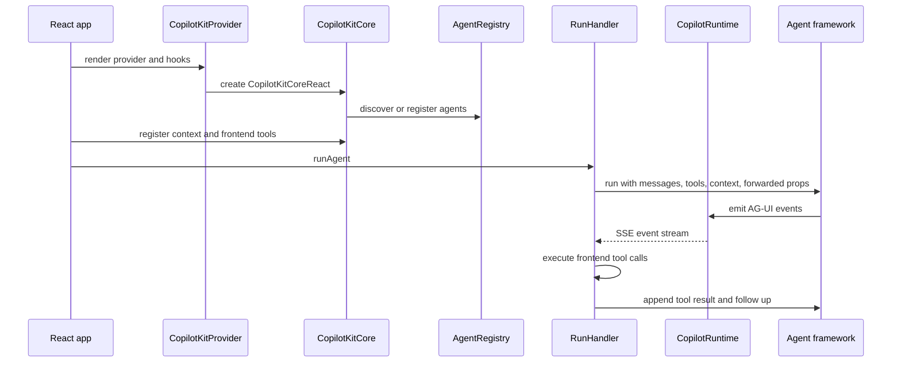
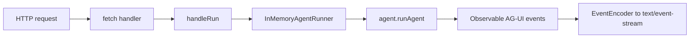

# 4. Core와 Runtime 코드 경로

이 장은 CopilotKit을 코드 실행 경로로 다시 읽습니다. 핵심 질문은 다음입니다.

```text
React 앱에서 사용자가 agent에게 요청을 보내면,
CopilotKit 내부에서 어떤 객체가 만들어지고,
tool은 언제 agent에게 전달되며,
tool result는 어떤 경로로 다시 agent observation이 되는가?
```

## 전체 호출 경로



이 흐름에서 CopilotKit이 하는 일은 agent 두뇌를 대체하는 것이 아닙니다. CopilotKit은 앱이 연 capability를 agent input으로 넣고, agent가 낸 event와 tool call을 앱과 다시 연결합니다.

## 1단계: Provider가 core를 만든다

React entrypoint는 `CopilotKitProvider`입니다.

근거:

| Source | 내용 |
| --- | --- |
| [`CopilotKitProvider.tsx#L114`](https://github.com/nfbs2000/speaky-CopilotKit/blob/5c50d9c51/packages/react-core/src/v2/providers/CopilotKitProvider.tsx#L114) | provider props가 runtime, headers, properties, local agents, renderToolCalls, frontendTools, HITL, OpenGenerativeUI, A2UI를 받습니다. |
| [`CopilotKitProvider.tsx#L572`](https://github.com/nfbs2000/speaky-CopilotKit/blob/5c50d9c51/packages/react-core/src/v2/providers/CopilotKitProvider.tsx#L572) | stable `CopilotKitCoreReact` instance를 생성합니다. |
| [`CopilotKitProvider.tsx#L693`](https://github.com/nfbs2000/speaky-CopilotKit/blob/5c50d9c51/packages/react-core/src/v2/providers/CopilotKitProvider.tsx#L693) | runtime URL, transport, headers, credentials, properties를 core setter로 sync합니다. |
| [`CopilotKitProvider.tsx#L726`](https://github.com/nfbs2000/speaky-CopilotKit/blob/5c50d9c51/packages/react-core/src/v2/providers/CopilotKitProvider.tsx#L726) | 첫 setter effect를 건너뛰어 child hook이 mount 중 등록한 tool을 provider-level tools가 덮어쓰지 않게 합니다. |

Provider는 단순 context wrapper가 아닙니다. core를 만들고, provider props와 hook 등록분을 합쳐 runtime boundary에 넣습니다.

## 2단계: Core가 subsystem을 나눈다

`CopilotKitCore` constructor는 다음 subsystem을 생성합니다.

| Subsystem | 근거 | 역할 |
| --- | --- | --- |
| `AgentRegistry` | [`core.ts#L354`](https://github.com/nfbs2000/speaky-CopilotKit/blob/5c50d9c51/packages/core/src/core/core.ts#L354) | runtime/local/proxied agent 관리 |
| `ContextStore` | [`core.ts#L366`](https://github.com/nfbs2000/speaky-CopilotKit/blob/5c50d9c51/packages/core/src/core/core.ts#L366) | app context 저장과 agent scope 필터링 |
| `SuggestionEngine` | [`core.ts#L371`](https://github.com/nfbs2000/speaky-CopilotKit/blob/5c50d9c51/packages/core/src/core/core.ts#L371) | suggestion lifecycle |
| `RunHandler` | [`core.ts#L377`](https://github.com/nfbs2000/speaky-CopilotKit/blob/5c50d9c51/packages/core/src/core/core.ts#L377) | agent run과 frontend tool execution |
| `StateManager` | [`core.ts#L390`](https://github.com/nfbs2000/speaky-CopilotKit/blob/5c50d9c51/packages/core/src/core/core.ts#L390) | messages, state, run association |
| `ThreadStoreRegistry` | [`core.ts#L400`](https://github.com/nfbs2000/speaky-CopilotKit/blob/5c50d9c51/packages/core/src/core/core.ts#L400) | thread store lifecycle |

이렇게 나누는 이유는 CopilotKit이 “하나의 chat component”가 아니라 agent application runtime surface이기 때문입니다.

## 3단계: AgentRegistry가 runtime agent를 발견한다

`AgentRegistry`는 local agent와 runtime-discovered agent를 모두 관리합니다.

핵심 코드:

| Source | 의미 |
| --- | --- |
| [`agent-registry.ts#L57`](https://github.com/nfbs2000/speaky-CopilotKit/blob/5c50d9c51/packages/core/src/core/agent-registry.ts#L57) | local agents, remote agents, runtime URL/status/transport, A2UI flags를 보관합니다. |
| [`agent-registry.ts#L238`](https://github.com/nfbs2000/speaky-CopilotKit/blob/5c50d9c51/packages/core/src/core/agent-registry.ts#L238) | `registerProxiedAgent`가 local `agentId`를 runtime `runtimeAgentId`로 연결합니다. |
| [`agent-registry.ts#L381`](https://github.com/nfbs2000/speaky-CopilotKit/blob/5c50d9c51/packages/core/src/core/agent-registry.ts#L381) | runtime `/info`를 fetch해 remote agent와 capability를 갱신합니다. |
| [`agent-registry.ts#L534`](https://github.com/nfbs2000/speaky-CopilotKit/blob/5c50d9c51/packages/core/src/core/agent-registry.ts#L534) | REST `/info`와 single endpoint `method: "info"`를 auto-detect합니다. |

Runtime `/info`는 단순 health check가 아닙니다. frontend가 “어떤 agent가 있고 A2UI가 가능한지”를 배우는 discovery endpoint입니다.

## 4단계: ContextStore가 agent별 context를 필터링한다

`ContextStore`는 app context를 agent input으로 보냅니다.

| Source | 의미 |
| --- | --- |
| [`context-store.ts#L6`](https://github.com/nfbs2000/speaky-CopilotKit/blob/5c50d9c51/packages/core/src/core/context-store.ts#L6) | `ScopedContext`에는 optional `agentIds`가 있습니다. |
| [`context-store.ts#L36`](https://github.com/nfbs2000/speaky-CopilotKit/blob/5c50d9c51/packages/core/src/core/context-store.ts#L36) | context를 추가하고 unsubscribe 함수를 돌려줍니다. |
| [`context-store.ts#L48`](https://github.com/nfbs2000/speaky-CopilotKit/blob/5c50d9c51/packages/core/src/core/context-store.ts#L48) | 특정 agent에 scope가 맞지 않는 context를 제외합니다. |

즉 CopilotKit에서 context는 global prompt 문자열이 아닙니다. agent별로 scope를 걸 수 있는 structured boundary입니다.

## 5단계: frontend tool이 registry에 들어간다

`useFrontendTool`은 mount 시 core tool registry에 tool을 추가합니다.

| Source | 의미 |
| --- | --- |
| [`use-frontend-tool.tsx#L7`](https://github.com/nfbs2000/speaky-CopilotKit/blob/5c50d9c51/packages/react-core/src/v2/hooks/use-frontend-tool.tsx#L7) | hook이 tool definition을 받아 core에 등록합니다. |
| [`use-frontend-tool.tsx#L23`](https://github.com/nfbs2000/speaky-CopilotKit/blob/5c50d9c51/packages/react-core/src/v2/hooks/use-frontend-tool.tsx#L23) | 동일 name/agentId tool이 있으면 mount 중 override할 수 있습니다. |
| [`use-frontend-tool.tsx#L35`](https://github.com/nfbs2000/speaky-CopilotKit/blob/5c50d9c51/packages/react-core/src/v2/hooks/use-frontend-tool.tsx#L35) | `tool.render`가 있으면 renderer도 등록합니다. |
| [`use-frontend-tool.tsx#L38`](https://github.com/nfbs2000/speaky-CopilotKit/blob/5c50d9c51/packages/react-core/src/v2/hooks/use-frontend-tool.tsx#L38) | unmount 시 tool은 제거하지만 chat history rendering 때문에 renderer는 의도적으로 남깁니다. |

여기서 이미 중요한 결론이 나옵니다.

```text
agent가 호출할 수 있는 tool은 app이 등록한 것뿐이다.
renderer는 과거 tool call 표시를 위해 남을 수 있지만, handler capability는 unmount되면 제거된다.
```

## 6단계: RunHandler가 agent run input을 만든다

`RunHandler`는 agent execution의 중심입니다.

| Source | 의미 |
| --- | --- |
| [`run-handler.ts#L217`](https://github.com/nfbs2000/speaky-CopilotKit/blob/5c50d9c51/packages/core/src/core/run-handler.ts#L217) | agent connect 시 `forwardedProps`, `tools`, `context`를 함께 전달합니다. |
| [`run-handler.ts#L289`](https://github.com/nfbs2000/speaky-CopilotKit/blob/5c50d9c51/packages/core/src/core/run-handler.ts#L289) | `runAgent`가 suggestions를 clear하고 headers를 적용하고 active run을 detach합니다. |
| [`run-handler.ts#L320`](https://github.com/nfbs2000/speaky-CopilotKit/blob/5c50d9c51/packages/core/src/core/run-handler.ts#L320) | `agent.runAgent({ forwardedProps, resume, tools, context }, subscriber)`를 호출합니다. |
| [`run-handler.ts#L887`](https://github.com/nfbs2000/speaky-CopilotKit/blob/5c50d9c51/packages/core/src/core/run-handler.ts#L887) | `buildFrontendTools`가 등록된 frontend tool을 AG-UI `Tool` schema로 변환합니다. |

agent에게 전달되는 입력은 단순 user message가 아닙니다.

```text
messages + tools + context + forwardedProps + state + thread/run metadata
```

이게 CopilotKit이 agent-native application framework인 이유입니다.

## 7단계: tool call을 찾아 handler를 실행한다

agent run 이후 `RunHandler`는 assistant message에 들어 있는 tool call을 순회합니다.

| Source | 의미 |
| --- | --- |
| [`run-handler.ts#L383`](https://github.com/nfbs2000/speaky-CopilotKit/blob/5c50d9c51/packages/core/src/core/run-handler.ts#L383) | 새 messages에서 assistant tool calls를 찾고 frontend tool을 실행합니다. |
| [`run-handler.ts#L462`](https://github.com/nfbs2000/speaky-CopilotKit/blob/5c50d9c51/packages/core/src/core/run-handler.ts#L462) | args를 parse하고 handler를 호출하며 execution start/end subscriber를 발생시킵니다. |
| [`run-handler.ts#L573`](https://github.com/nfbs2000/speaky-CopilotKit/blob/5c50d9c51/packages/core/src/core/run-handler.ts#L573) | specific tool handler result를 처리합니다. |
| [`run-handler.ts#L634`](https://github.com/nfbs2000/speaky-CopilotKit/blob/5c50d9c51/packages/core/src/core/run-handler.ts#L634) | wildcard `*` tool도 같은 방식으로 처리합니다. |

tool execution의 핵심은 result가 UI state로만 남지 않는다는 점입니다.

## 8단계: tool result를 message history에 삽입한다

source의 핵심 부분은 `executeSpecificTool`입니다. handler result가 만들어지면 CopilotKit은 parent assistant message 뒤에 `role: "tool"` message를 삽입합니다.

근거:

| Source | 의미 |
| --- | --- |
| [`run-handler.ts#L612`](https://github.com/nfbs2000/speaky-CopilotKit/blob/5c50d9c51/packages/core/src/core/run-handler.ts#L612) | tool result message를 parent assistant message 다음 index에 삽입합니다. |
| [`run-handler.ts#L620`](https://github.com/nfbs2000/speaky-CopilotKit/blob/5c50d9c51/packages/core/src/core/run-handler.ts#L620) | error가 없고 `followUp !== false`이면 follow-up이 필요하다고 반환합니다. |
| [`run-handler.ts#L742`](https://github.com/nfbs2000/speaky-CopilotKit/blob/5c50d9c51/packages/core/src/core/run-handler.ts#L742) | wildcard tool도 같은 follow-up rule을 적용합니다. |

이 부분이 “tool card가 result를 삼키면 안 된다”는 결론의 source 근거입니다.

정상 흐름:

```text
assistant tool call
-> frontend handler
-> role tool message
-> follow-up run
-> agent reads observation
-> next action
```

비정상 흐름:

```text
assistant tool call
-> UI card displays success
-> no role tool message
-> no follow-up
-> agent cannot replan
```

## 9단계: StateManager가 run과 messages를 추적한다

CopilotKit은 AG-UI state event도 추적합니다.

| Source | 의미 |
| --- | --- |
| [`state-manager.ts#L17`](https://github.com/nfbs2000/speaky-CopilotKit/blob/5c50d9c51/packages/core/src/core/state-manager.ts#L17) | `stateByRun`, `messageToRun`, `activeRun`, `agentSubscriptions`를 보관합니다. |
| [`state-manager.ts#L84`](https://github.com/nfbs2000/speaky-CopilotKit/blob/5c50d9c51/packages/core/src/core/state-manager.ts#L84) | run started/finished/error, state snapshot/delta, message snapshot/new message를 subscribe합니다. |
| [`state-manager.ts#L200`](https://github.com/nfbs2000/speaky-CopilotKit/blob/5c50d9c51/packages/core/src/core/state-manager.ts#L200) | run state snapshot/delta를 runId/threadId 기준으로 적용합니다. |
| [`state-manager.ts#L271`](https://github.com/nfbs2000/speaky-CopilotKit/blob/5c50d9c51/packages/core/src/core/state-manager.ts#L271) | messages를 run과 연결합니다. |

이 구조 때문에 “현재 UI state”와 “agent thread/run state”가 구분됩니다. Mothership처럼 long-running workflow를 다룰 때 이 구분이 중요합니다.

## 10단계: Runtime은 AG-UI stream을 만든다

server runtime 쪽에서 request는 `fetch-handler`로 들어옵니다.

| Source | 의미 |
| --- | --- |
| [`fetch-handler.ts#L117`](https://github.com/nfbs2000/speaky-CopilotKit/blob/5c50d9c51/packages/runtime/src/v2/runtime/core/fetch-handler.ts#L117) | CORS, `onRequest`, before middleware, route matching, dispatch, response hooks를 처리합니다. |
| [`fetch-handler.ts#L300`](https://github.com/nfbs2000/speaky-CopilotKit/blob/5c50d9c51/packages/runtime/src/v2/runtime/core/fetch-handler.ts#L300) | `agent/run`, `agent/connect`, `agent/stop`, `info`, thread endpoint를 dispatch합니다. |
| [`handle-run.ts#L33`](https://github.com/nfbs2000/speaky-CopilotKit/blob/5c50d9c51/packages/runtime/src/v2/runtime/handlers/handle-run.ts#L33) | agent clone과 run request parse를 수행합니다. |
| [`agent-utils.ts#L56`](https://github.com/nfbs2000/speaky-CopilotKit/blob/5c50d9c51/packages/runtime/src/v2/runtime/handlers/shared/agent-utils.ts#L56) | A2UI, MCP Apps, OpenGenerativeUI middleware를 agent에 붙입니다. |
| [`sse-response.ts#L82`](https://github.com/nfbs2000/speaky-CopilotKit/blob/5c50d9c51/packages/runtime/src/v2/runtime/handlers/shared/sse-response.ts#L82) | observable event를 SSE로 encode합니다. |

SSE runtime의 최종 형태는 다음입니다.



## 코드 경로의 결론

CopilotKit에서 핵심 경로는 다음입니다.

```text
Provider creates core
-> hooks register context/tools/renderers
-> AgentRegistry discovers runtime agents
-> RunHandler sends tools/context/props to agent
-> agent emits AG-UI events and tool calls
-> RunHandler executes frontend tool handlers
-> tool result becomes role tool message
-> follow-up run lets agent read observation
-> StateManager and renderers project state to UI
```

따라서 CopilotKit을 Mothership에 붙일 때도 구현의 기준은 tool card가 아닙니다. 기준은 “Mothership의 event/result/checkpoint를 어떻게 AG-UI event와 CopilotKit renderer로 투영하되, observation ownership을 Mothership agent loop에 유지할 것인가”입니다.
