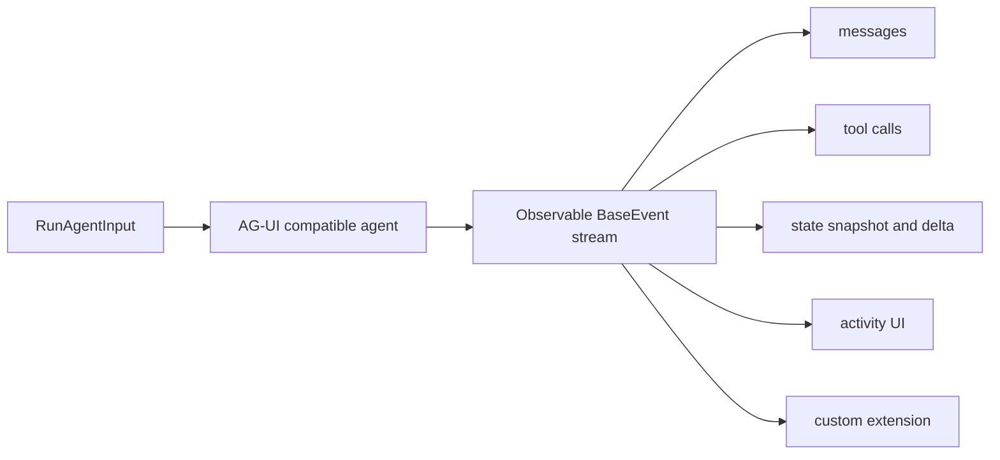
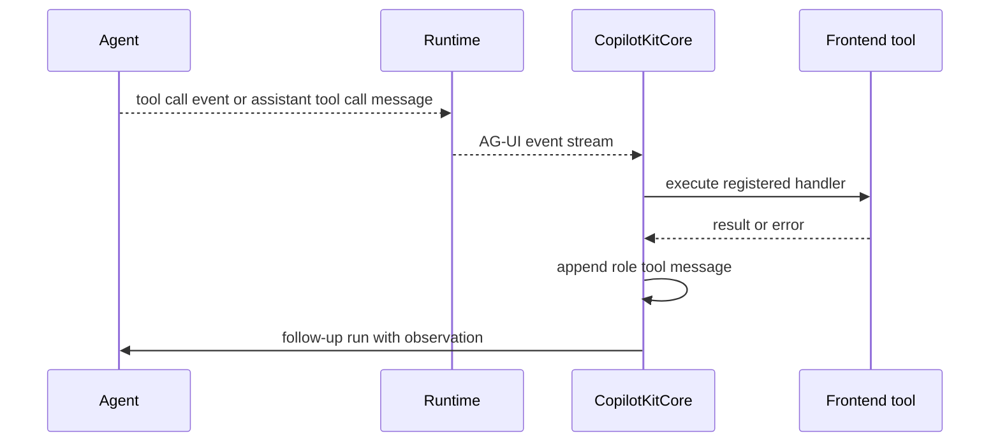
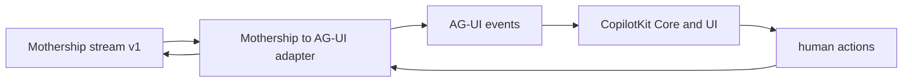

# 5. AG-UI 이벤트 모델

CopilotKit을 AG-UI 관점에서 보면 설계가 더 선명해집니다. AG-UI는 “React component를 agent가 직접 조작하는 방식”이 아닙니다. AG-UI는 agent와 frontend가 주고받는 typed event stream입니다.

## 짧은 답

AG-UI는 agent와 frontend 사이의 event protocol입니다. agent는 `run(input) -> Observable<BaseEvent>` 형태로 lifecycle, text, tool, state, activity, custom event를 흘리고, CopilotKit runtime은 이를 SSE로 전달하며, frontend core는 message/state/tool renderer로 투영합니다.

## AG-UI의 기본 모델

`skills/copilotkit-agui/SKILL.md`와 shell docs는 AG-UI를 다음 구조로 설명합니다.

```text
run(input: RunAgentInput) -> Observable<BaseEvent>
```

즉 agent는 한 번 호출되면 event stream을 반환합니다. frontend는 이 event를 받아 message, state, tool, activity, custom UI를 갱신합니다.



근거:

| Source | 내용 |
| --- | --- |
| [`skills/copilotkit-agui/SKILL.md`](https://github.com/nfbs2000/speaky-CopilotKit/blob/5c50d9c51/skills/copilotkit-agui/SKILL.md) | AG-UI event family, SSE format, protocol rule을 설명합니다. |
| [`showcase/shell-docs/src/content/ag-ui/concepts/architecture.mdx`](https://github.com/nfbs2000/speaky-CopilotKit/blob/5c50d9c51/showcase/shell-docs/src/content/ag-ui/concepts/architecture.mdx) | `run(input) -> Observable<BaseEvent>` 관점의 architecture를 설명합니다. |
| [`showcase/shell-docs/src/content/ag-ui/concepts/tools.mdx`](https://github.com/nfbs2000/speaky-CopilotKit/blob/5c50d9c51/showcase/shell-docs/src/content/ag-ui/concepts/tools.mdx) | frontend-defined tools와 tool lifecycle을 설명합니다. |

## event family

AG-UI event family는 application protocol을 UI에 투영하기 위한 vocabulary입니다.

| Family | 의미 | CopilotKit에서 중요한 이유 |
| --- | --- | --- |
| Lifecycle | run started, run finished, run error | UI와 thread store가 run boundary를 압니다. |
| Text | assistant text streaming | chat UI와 transcript가 만들어집니다. |
| Tool | tool call start, args, result | capability invocation과 observation이 이어집니다. |
| State | state snapshot, delta | shared app state를 run/thread와 연결합니다. |
| Reasoning | reasoning/thinking trace | 내부 사고나 진행 설명을 별도 channel로 둘 수 있습니다. |
| Activity | progress/activity surface | long-running 작업과 generative UI progress를 보여줍니다. |
| Custom | extension event | Mothership 같은 app-specific event를 보존할 수 있습니다. |

핵심은 event가 UI rendering만 위한 것이 아니라 agent loop와 app state를 연결하는 contract라는 점입니다.

## SSE wire format

CopilotKit runtime은 AG-UI event를 SSE로 전달할 수 있습니다.

근거:

| Source | 내용 |
| --- | --- |
| [`sse-response.ts#L24`](https://github.com/nfbs2000/speaky-CopilotKit/blob/5c50d9c51/packages/runtime/src/v2/runtime/handlers/shared/sse-response.ts#L24) | `TransformStream`과 `EventEncoder`를 생성합니다. |
| [`sse-response.ts#L82`](https://github.com/nfbs2000/speaky-CopilotKit/blob/5c50d9c51/packages/runtime/src/v2/runtime/handlers/shared/sse-response.ts#L82) | observable event를 subscribe하고 encode해서 stream에 씁니다. |
| [`sse-response.ts#L184`](https://github.com/nfbs2000/speaky-CopilotKit/blob/5c50d9c51/packages/runtime/src/v2/runtime/handlers/shared/sse-response.ts#L184) | response header를 `text/event-stream`으로 둡니다. |

이 말은 runtime이 model output을 string으로만 주는 것이 아니라 structured event stream으로 준다는 뜻입니다.

## Tool lifecycle

frontend tool 관점의 정상 흐름은 다음입니다.



CopilotKit source에서 frontend tool result가 message history로 들어가는 부분은 [`run-handler.ts#L612`](https://github.com/nfbs2000/speaky-CopilotKit/blob/5c50d9c51/packages/core/src/core/run-handler.ts#L612)입니다.

AG-UI 관점에서 중요한 rule은 `toolCallId`입니다. tool start, args, result, renderer state가 같은 invocation에 속한다는 것을 묶기 때문입니다. Mothership stream-v1도 `toolCallId`를 갖고 있으므로 AG-UI mapping이 가능합니다.

## State lifecycle

state event는 “UI local state”와 “agent shared state”를 구분하게 해줍니다.

`StateManager`는 run started/finished/error, state snapshot/delta, message snapshot/new message를 subscribe합니다.

근거:

| Source | 의미 |
| --- | --- |
| [`state-manager.ts#L84`](https://github.com/nfbs2000/speaky-CopilotKit/blob/5c50d9c51/packages/core/src/core/state-manager.ts#L84) | AG-UI lifecycle, state, message events에 subscribe합니다. |
| [`state-manager.ts#L200`](https://github.com/nfbs2000/speaky-CopilotKit/blob/5c50d9c51/packages/core/src/core/state-manager.ts#L200) | snapshot/delta를 run/thread 기준으로 저장합니다. |
| [`state-manager.ts#L271`](https://github.com/nfbs2000/speaky-CopilotKit/blob/5c50d9c51/packages/core/src/core/state-manager.ts#L271) | message를 run에 연결합니다. |

Mothership처럼 checkpoint, resource, run state가 많은 application에서는 모든 것을 text로 흘리면 안 됩니다. 상태성 있는 것은 state delta 또는 app-specific activity/custom event로 분리해야 합니다.

## Activity lifecycle

Activity event는 agent가 장시간 작업 중인 상태를 UI에 전달하는 데 유용합니다. CopilotKit의 OpenGenerativeUI middleware가 이 패턴을 보여줍니다.

근거:

| Source | 내용 |
| --- | --- |
| [`open-generative-ui-middleware.ts#L39`](https://github.com/nfbs2000/speaky-CopilotKit/blob/5c50d9c51/packages/runtime/src/v2/runtime/open-generative-ui-middleware.ts#L39) | streaming `generateSandboxedUi` tool args를 parsing합니다. |
| [`open-generative-ui-middleware.ts#L270`](https://github.com/nfbs2000/speaky-CopilotKit/blob/5c50d9c51/packages/runtime/src/v2/runtime/open-generative-ui-middleware.ts#L270) | tool call args가 activity snapshot/delta로 투영됩니다. |
| [`open-generative-ui-middleware.ts#L320`](https://github.com/nfbs2000/speaky-CopilotKit/blob/5c50d9c51/packages/runtime/src/v2/runtime/open-generative-ui-middleware.ts#L320) | tool end 시 generating 상태를 false로 바꿉니다. |

이 패턴은 Mothership의 subagent span, workflow progress, resource update에도 적용할 수 있습니다.

## AG-UI와 A2UI의 차이

AG-UI와 A2UI를 섞어서 보면 안 됩니다.

| 개념 | 역할 |
| --- | --- |
| AG-UI | agent와 UI 사이의 event protocol입니다. lifecycle, text, tool, state, activity를 다룹니다. |
| A2UI | agent가 catalog 기반 declarative UI surface를 조작하는 renderer layer입니다. |
| OpenGenerativeUI | sandboxed/generated UI를 activity/tool stream으로 투영하는 middleware입니다. |

A2UI는 AG-UI 위의 UI operation layer로 읽어야 합니다. A2UI가 있다고 해서 agent loop의 tool result ownership이 renderer로 넘어가는 것은 아닙니다.

## Runtime `/info`와 A2UI capability

Runtime `/info`는 frontend가 runtime capability를 배우는 곳입니다.

근거:

| Source | 내용 |
| --- | --- |
| [`get-runtime-info.ts#L37`](https://github.com/nfbs2000/speaky-CopilotKit/blob/5c50d9c51/packages/runtime/src/v2/runtime/handlers/get-runtime-info.ts#L37) | agents와 capabilities를 resolve합니다. |
| [`get-runtime-info.ts#L76`](https://github.com/nfbs2000/speaky-CopilotKit/blob/5c50d9c51/packages/runtime/src/v2/runtime/handlers/get-runtime-info.ts#L76) | version, agents, mode, thread endpoints, intelligence, A2UI flags를 응답합니다. |
| [`get-runtime-info.ts#L92`](https://github.com/nfbs2000/speaky-CopilotKit/blob/5c50d9c51/packages/runtime/src/v2/runtime/handlers/get-runtime-info.ts#L92) | legacy `a2uiEnabled`와 source-of-truth `a2ui` object를 포함합니다. |

frontend `AgentRegistry`는 이 정보를 읽고 A2UI enabled, openGenerativeUI enabled, license status 등을 갱신합니다.

## Mothership에는 AG-UI adapter가 필요하다

Mothership stream-v1은 이미 application-level event protocol을 갖고 있습니다.

근거:

| Source | 내용 |
| --- | --- |
| [`mothership-stream-v1.ts#L4`](https://github.com/nfbs2000/speaky-sim/blob/db47da58d/apps/sim/lib/copilot/generated/mothership-stream-v1.ts#L4) | Go to Sim execution-oriented stream contract입니다. |
| [`mothership-stream-v1.ts#L7`](https://github.com/nfbs2000/speaky-sim/blob/db47da58d/apps/sim/lib/copilot/generated/mothership-stream-v1.ts#L7) | session, text, tool, span, resource, checkpoint, compaction, error, complete event union입니다. |
| [`mothership-stream-v1.ts#L135`](https://github.com/nfbs2000/speaky-sim/blob/db47da58d/apps/sim/lib/copilot/generated/mothership-stream-v1.ts#L135) | tool call descriptor가 `toolCallId`, executor, mode, phase, status를 가집니다. |
| [`mothership-stream-v1.ts#L187`](https://github.com/nfbs2000/speaky-sim/blob/db47da58d/apps/sim/lib/copilot/generated/mothership-stream-v1.ts#L187) | tool result event가 success/error/output/status를 가집니다. |

따라서 Mothership을 CopilotKit에 붙이는 가장 좋은 방법은 Mothership protocol을 버리는 것이 아니라 AG-UI adapter를 두는 것입니다.



## 이 장의 결론

AG-UI는 “모델이 UI를 마음대로 조작한다”는 의미가 아닙니다. AG-UI는 agent runtime과 frontend가 같은 event vocabulary를 쓰도록 만드는 protocol입니다.

Mothership 같은 application protocol이 이미 있다면, CopilotKit을 중심 runtime으로 바꾸는 것보다 Mothership stream을 AG-UI event로 투영하는 adapter를 만드는 편이 더 정확합니다.
