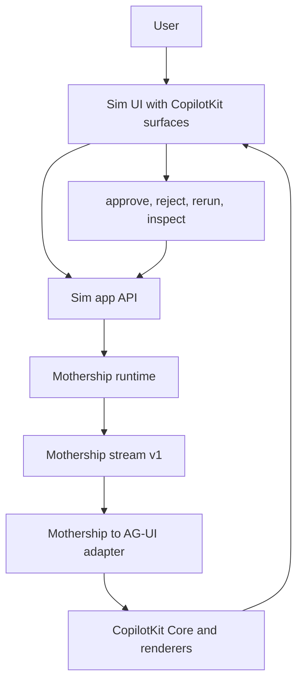

# 7. Mothership 적용 설계

이 장은 CopilotKit/AG-UI를 Sim Mothership 같은 application layer에 붙이는 설계를 다룹니다. 결론부터 말하면, Mothership protocol을 CopilotKit tool card 안으로 집어넣으면 안 됩니다. Mothership protocol을 원천으로 유지하고, 그 stream을 AG-UI event와 CopilotKit renderer로 투영해야 합니다.

## Mothership은 이미 application protocol을 갖고 있다

Sim source에는 Mothership stream-v1 contract가 있습니다.

근거:

| Source | 내용 |
| --- | --- |
| [`mothership-stream-v1.ts#L4`](https://github.com/nfbs2000/speaky-sim/blob/db47da58d/apps/sim/lib/copilot/generated/mothership-stream-v1.ts#L4) | Go to Sim execution-oriented stream contract입니다. |
| [`mothership-stream-v1.ts#L7`](https://github.com/nfbs2000/speaky-sim/blob/db47da58d/apps/sim/lib/copilot/generated/mothership-stream-v1.ts#L7) | session, text, tool, span, resource, checkpoint, compaction, error, complete union입니다. |
| [`mothership-stream-v1.ts#L28`](https://github.com/nfbs2000/speaky-sim/blob/db47da58d/apps/sim/lib/copilot/generated/mothership-stream-v1.ts#L28) | text channel, tool executor, tool mode, status enum을 정의합니다. |
| [`mothership-stream-v1.ts#L135`](https://github.com/nfbs2000/speaky-sim/blob/db47da58d/apps/sim/lib/copilot/generated/mothership-stream-v1.ts#L135) | tool call descriptor가 args, executor, mode, partial, phase, requiresConfirmation, status, `toolCallId`, UI metadata를 가집니다. |
| [`mothership-stream-v1.ts#L187`](https://github.com/nfbs2000/speaky-sim/blob/db47da58d/apps/sim/lib/copilot/generated/mothership-stream-v1.ts#L187) | tool result event가 error, executor, mode, output, status, success, `toolCallId`, `toolName`을 가집니다. |
| [`mothership-stream-v1.ts#L303`](https://github.com/nfbs2000/speaky-sim/blob/db47da58d/apps/sim/lib/copilot/generated/mothership-stream-v1.ts#L303) | checkpoint pause/resumed event가 runId, executionId, pending tool calls, frames를 가집니다. |
| [`mothership-stream-v1.ts#L387`](https://github.com/nfbs2000/speaky-sim/blob/db47da58d/apps/sim/lib/copilot/generated/mothership-stream-v1.ts#L387) | complete event가 status, usage, cost를 가집니다. |

이 contract는 AG-UI와 같은 수준의 application event protocol입니다. 따라서 CopilotKit을 붙일 때 Mothership stream을 없애는 것이 아니라, stream-v1을 AG-UI로 변환해야 합니다.

## 현재 Sim 쪽 실행 경로

Mothership execute route는 headless Copilot lifecycle과 streaming response를 이미 가지고 있습니다.

근거:

| Source | 내용 |
| --- | --- |
| [`execute/route.ts#L78`](https://github.com/nfbs2000/speaky-sim/blob/db47da58d/apps/sim/app/api/mothership/execute/route.ts#L78) | POST `/api/mothership/execute`는 internal executor JWT로 보호되고 JSON/NDJSON 호출을 처리합니다. |
| [`execute/route.ts#L130`](https://github.com/nfbs2000/speaky-sim/blob/db47da58d/apps/sim/app/api/mothership/execute/route.ts#L130) | workspace access, context, integration tools, user skill tool, request payload를 구성합니다. |
| [`execute/route.ts#L222`](https://github.com/nfbs2000/speaky-sim/blob/db47da58d/apps/sim/app/api/mothership/execute/route.ts#L222) | `runHeadlessCopilotLifecycle`을 `autoExecuteTools: true`, `interactive: false`, `goRoute: '/api/mothership/execute'`로 호출합니다. |
| [`execute/route.ts#L237`](https://github.com/nfbs2000/speaky-sim/blob/db47da58d/apps/sim/app/api/mothership/execute/route.ts#L237) | stream response에서는 heartbeat, assistant text chunk, final/error event를 NDJSON으로 보냅니다. |
| [`execute/route.ts#L366`](https://github.com/nfbs2000/speaky-sim/blob/db47da58d/apps/sim/app/api/mothership/execute/route.ts#L366) | non-stream response는 final JSON payload를 반환합니다. |

이 코드를 보면 Mothership은 이미 server-side execution ownership을 가지고 있습니다. CopilotKit frontend tool로 이 ownership을 빼앗으면 안 됩니다.

## Sim tool routing도 이미 있다

Sim에는 tool event 처리와 client-executable tool reporting이 있습니다.

근거:

| Source | 내용 |
| --- | --- |
| [`tool.ts#L62`](https://github.com/nfbs2000/speaky-sim/blob/db47da58d/apps/sim/lib/copilot/request/handlers/tool.ts#L62) | client-executable tool SSE frame을 보내기 전에 durable async tool row를 먼저 저장해 confirmation race를 막습니다. |
| [`tool.ts#L170`](https://github.com/nfbs2000/speaky-sim/blob/db47da58d/apps/sim/lib/copilot/request/handlers/tool.ts#L170) | result phase가 tool state를 terminal result/error로 갱신합니다. |
| [`tool.ts#L236`](https://github.com/nfbs2000/speaky-sim/blob/db47da58d/apps/sim/lib/copilot/request/handlers/tool.ts#L236) | call phase가 partial/generating, main/subagent scope, client/sim executable routing을 처리합니다. |
| [`run-tool-execution.ts#L188`](https://github.com/nfbs2000/speaky-sim/blob/db47da58d/apps/sim/lib/copilot/tools/client/run-tool-execution.ts#L188) | client-side workflow execution은 streaming endpoint를 사용하고 `/api/copilot/confirm`으로 completion을 보고합니다. |
| [`tool-call-state.ts#L77`](https://github.com/nfbs2000/speaky-sim/blob/db47da58d/apps/sim/lib/copilot/request/tool-call-state.ts#L77) | terminal tool call state를 status/result/error로 확정합니다. |

이 구조는 CopilotKit을 붙일 때 반드시 보존해야 합니다. CopilotKit renderer가 result를 “완료”로 보여줄 수는 있지만, result의 원천은 Sim/Mothership tool state여야 합니다.

## 권장 architecture

권장 구조는 다음입니다.



핵심 원칙:

| 원칙 | 설명 |
| --- | --- |
| Mothership stream-v1이 원천이다 | tool status, checkpoint, resource, result ownership은 Mothership에 둡니다. |
| AG-UI는 projection이다 | Mothership events를 CopilotKit이 이해할 수 있는 lifecycle/text/tool/state/activity/custom event로 변환합니다. |
| CopilotKit renderer는 UI surface다 | workflow card, tool card, checkpoint modal, resource panel을 그립니다. |
| frontend tool은 browser/human boundary만 담당한다 | approve, reject, select file, open panel처럼 frontend가 원천인 action만 맡깁니다. |
| backend execution은 Sim/Mothership executor가 담당한다 | auth, audit, retry, logs, checkpoint, cancellation을 보존합니다. |

## Mothership stream to AG-UI mapping

Mothership event를 AG-UI로 mapping하는 기준입니다.

| Mothership event | AG-UI projection | 비고 |
| --- | --- | --- |
| `session_start` | `RUN_STARTED` plus optional `CUSTOM` metadata | session/run/thread id를 보존합니다. |
| `session_chat` | message snapshot or `CUSTOM` | chat metadata가 있으면 thread state로 둡니다. |
| `session_title` | `STATE_DELTA` or `CUSTOM` | title은 UI state에 가깝습니다. |
| `session_trace` | `CUSTOM` or activity metadata | trace id, span id는 observability로 유지합니다. |
| `text` channel `assistant` | `TEXT_MESSAGE_START`, `TEXT_MESSAGE_CONTENT`, `TEXT_MESSAGE_END` | streaming chunk 누적이 필요합니다. |
| `text` channel `thinking` | reasoning event or `ACTIVITY_DELTA` | 사용자 노출 정책에 따라 다릅니다. |
| `tool_call` | `TOOL_CALL_START` plus args snapshot | `toolCallId`, `toolName`, executor, mode를 보존합니다. |
| `tool_args_delta` | `TOOL_CALL_ARGS` delta | partial args stream을 이어붙입니다. |
| `tool_result` | tool result event plus `role: tool` observation | success/error/output을 agent loop로 돌려야 합니다. |
| `subagent_start/end` | `ACTIVITY_SNAPSHOT` and `ACTIVITY_DELTA` | subagent span은 progress UI에 적합합니다. |
| `structured_result` | `ACTIVITY_DELTA`, `STATE_DELTA`, or `CUSTOM` | domain schema에 따라 선택합니다. |
| `resource_upsert/remove` | `STATE_DELTA` or `ACTIVITY_DELTA` | resource list가 앱 state이면 state delta입니다. |
| `checkpoint_pause` | HITL interrupt/custom event | approve/reject/resume UI가 필요합니다. |
| `run_resumed` | `CUSTOM` plus activity update | pending checkpoint 해제입니다. |
| `compaction_start/done` | `ACTIVITY_DELTA` | long-running run의 maintenance event입니다. |
| `error` | `RUN_ERROR` or tool error | run-level인지 tool-level인지 구분합니다. |
| `complete` | `RUN_FINISHED` | usage/cost를 metadata로 보존합니다. |

중요한 것은 `toolCallId`, `runId`, `executionId`, `workspaceId`, `requestId` 같은 correlation id를 잃지 않는 것입니다.

## Adapter pseudo-code

개념적으로는 다음 adapter가 필요합니다.

```ts
type MothershipToAgUiOptions = {
  stream: AsyncIterable<MothershipStreamV1Event>
  threadId: string
  runId: string
}

async function* mothershipToAgUiEvents(options: MothershipToAgUiOptions) {
  yield { type: 'RUN_STARTED', threadId: options.threadId, runId: options.runId }

  for await (const event of options.stream) {
    switch (event.type) {
      case 'text':
        if (event.channel === 'assistant') {
          yield { type: 'TEXT_MESSAGE_CONTENT', delta: event.text }
        } else {
          yield { type: 'ACTIVITY_DELTA', payload: { kind: 'thinking', text: event.text } }
        }
        break

      case 'tool_call':
        yield {
          type: 'TOOL_CALL_START',
          toolCallId: event.toolCallId,
          toolName: event.toolName,
          args: event.args,
        }
        break

      case 'tool_args_delta':
        yield {
          type: 'TOOL_CALL_ARGS',
          toolCallId: event.toolCallId,
          delta: event.delta,
        }
        break

      case 'tool_result':
        yield {
          type: 'TOOL_CALL_RESULT',
          toolCallId: event.toolCallId,
          result: event.output,
          error: event.error,
        }
        break

      case 'checkpoint_pause':
        yield {
          type: 'CUSTOM',
          name: 'mothership.checkpoint.pause',
          payload: event,
        }
        break

      case 'complete':
        yield { type: 'RUN_FINISHED', status: event.status }
        break
    }
  }
}
```

실제 implementation에서는 AG-UI package의 정확한 event type name과 payload shape에 맞춰야 합니다. 여기서 중요한 것은 설계 방향입니다. Mothership stream을 버리지 않고 AG-UI로 변환합니다.

## Runtime integration 선택지

구현 경로는 두 가지가 있습니다.

### 선택지 A: MothershipAgUiAgent

`AbstractAgent` 또는 CopilotKit compatible agent를 만들어 `runAgent` 내부에서 Mothership stream endpoint를 호출하고 AG-UI event로 변환합니다.

장점:

| 장점 | 설명 |
| --- | --- |
| CopilotKit runtime 모델에 잘 맞음 | frontend는 ordinary AG-UI agent처럼 봅니다. |
| RunHandler와 StateManager를 그대로 활용 | lifecycle, state, renderer 연결이 자연스럽습니다. |
| frontend code가 단순해짐 | `useAgent` 중심으로 붙일 수 있습니다. |

주의:

| 주의 | 설명 |
| --- | --- |
| Mothership auth/context를 안전하게 전달해야 함 | workspace/user/session boundary가 중요합니다. |
| backend execution ownership을 유지해야 함 | adapter가 tool을 직접 재실행하면 안 됩니다. |
| checkpoint resume path가 필요함 | HITL action을 Mothership endpoint로 되돌려야 합니다. |

### 선택지 B: UI-side stream adapter

Sim UI가 Mothership NDJSON/SSE stream을 직접 받아 CopilotKit-style renderer store에 투영합니다.

장점:

| 장점 | 설명 |
| --- | --- |
| 기존 Mothership route를 덜 바꿈 | 빠르게 붙일 수 있습니다. |
| app-specific UI control이 쉬움 | Sim store와 직접 연결됩니다. |

주의:

| 주의 | 설명 |
| --- | --- |
| CopilotKit RunHandler follow-up path를 우회할 수 있음 | tool result observation 연결을 직접 보장해야 합니다. |
| AG-UI 표준 agent와 멀어질 수 있음 | 장기적으로 유지보수 비용이 커질 수 있습니다. |
| thread/run state가 중복될 수 있음 | Sim state와 CopilotKit state의 owner를 분리해야 합니다. |

장기적으로는 선택지 A가 더 맞습니다. Mothership을 AG-UI compatible agent로 노출하면 CopilotKit의 core/runtime/state/renderer 구조를 자연스럽게 쓸 수 있습니다.

## `followUp: false` 금지 기준

Mothership에서는 대부분의 domain tool에 `followUp: false`를 쓰면 안 됩니다.

금지해야 하는 흐름:

| 흐름 | 이유 |
| --- | --- |
| read -> plan -> write | read result가 다음 plan의 evidence입니다. |
| workflow create -> execute -> logs -> repair | create 성공은 전체 task 완료가 아닙니다. |
| deploy -> health check -> rollback decision | deploy result를 agent가 읽어야 합니다. |
| checkpoint approve -> resume -> verify | approve는 중간 event입니다. |
| subagent result -> parent planning | subagent output이 parent agent observation입니다. |

허용 가능한 흐름:

| 흐름 | 이유 |
| --- | --- |
| local panel open | planning input이 아닙니다. |
| copy result | 이미 final response 이후의 UI action입니다. |
| local selection highlight | browser-only projection입니다. |

기준은 간단합니다.

```text
이 tool result를 누가 읽고 다음 결정을 내려야 하는가?
답이 agent/runtime이면 followUp을 끊으면 안 된다.
```

## Mothership UI surface 제안

CopilotKit/A2UI를 써서 만들 수 있는 Mothership surface입니다.

| Surface | 입력 event | 동작 |
| --- | --- | --- |
| Tool timeline | `tool_call`, `tool_args_delta`, `tool_result` | tool status, args, output, error, retry 가능 여부 표시 |
| Workflow execution card | resource, tool, span events | workflow 실행 단계, current node, logs, result 표시 |
| Checkpoint modal | `checkpoint_pause`, `run_resumed` | approve/reject/edit/resume action |
| Subagent span panel | `subagent_start/end`, structured result | subagent별 진행과 결과 표시 |
| Resource panel | `resource_upsert/remove` | 생성/수정된 파일, workflow, table, KB resource 표시 |
| Cost/usage footer | `complete` | token, cost, status 표시 |
| Trace drawer | `session_trace`, spans | requestId, goTraceId, spanId 기반 debugging |

이 surface들은 CopilotKit renderer나 A2UI surface로 만들 수 있습니다. 다만 renderer가 execution owner가 되면 안 됩니다.

## API boundary 제안

Sim 쪽에서는 다음 boundary를 두는 편이 좋습니다.

```text
/api/mothership/execute
  Mothership execution owner
  returns Mothership stream v1

/api/mothership/agui/run
  adapter endpoint
  accepts AG-UI RunAgentInput
  calls Mothership execute
  returns AG-UI SSE

/api/mothership/checkpoint/respond
  checkpoint approve/reject/edit/resume
  returns accepted action or resumed stream metadata
```

`/api/mothership/agui/run`은 CopilotKit runtime handler와 직접 맞물리게 할 수 있습니다. 또는 `MothershipAgUiAgent`가 내부적으로 `/api/mothership/execute`를 호출해도 됩니다.

중요한 것은 `/api/mothership/execute`가 계속 execution source of truth라는 점입니다.

## 실패 모드와 방지책

| 실패 모드 | 원인 | 방지책 |
| --- | --- | --- |
| tool card가 success를 보여주지만 agent가 다음 행동을 안 함 | result가 observation으로 돌아가지 않음 | tool result를 AG-UI tool result 또는 `role: tool` message로 보장 |
| 같은 backend tool이 두 번 실행됨 | frontend tool과 Mothership executor가 모두 실행 | backend tool은 Mothership만 실행, CopilotKit은 projection |
| checkpoint modal이 떠도 run이 resume되지 않음 | UI action이 Mothership endpoint로 돌아가지 않음 | checkpoint action endpoint와 correlation id 보존 |
| subagent result가 parent plan에 반영되지 않음 | span UI만 표시하고 parent observation 누락 | structured result를 Mothership protocol과 AG-UI observation에 모두 보존 |
| long run 후 state가 꼬임 | UI local state와 run/thread state owner가 섞임 | state owner를 Mothership stream으로 고정하고 AG-UI는 projection |

## 구현 순서

추천 순서입니다.

1. Mothership stream-v1 event를 AG-UI event로 변환하는 pure adapter를 먼저 만듭니다.
2. `toolCallId`, `runId`, `executionId`, `requestId` correlation을 보존하는 테스트를 씁니다.
3. `text`, `tool_call`, `tool_result`, `complete`, `error`만 먼저 mapping합니다.
4. 그 다음 `checkpoint_pause`, `run_resumed`, `resource`, `span`을 mapping합니다.
5. CopilotKit renderer는 mapping된 event를 표시만 하게 만듭니다.
6. HITL action은 Mothership checkpoint endpoint로 되돌립니다.
7. A2UI surface는 workflow/resource/checkpoint 같은 domain component catalog부터 시작합니다.

## 결론

Mothership에 CopilotKit을 붙일 때의 올바른 중심은 다음입니다.

```text
Mothership protocol is source of truth.
AG-UI is the projection protocol.
CopilotKit is the React/runtime integration layer.
A2UI is an optional surface operation layer.
```

이렇게 설계하면 CopilotKit은 Mothership tool call을 가로채는 문제가 아니라, Mothership의 tool, checkpoint, workflow, resource, subagent span을 사용자가 이해할 수 있는 agent-native UI로 보여주는 layer가 됩니다.
