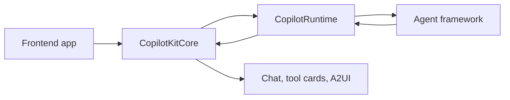

# CopilotKit Source Notes

이 문서는 `/Users/realpio4/Documents/speaky-CopilotKit` source를 기준으로 CopilotKit을 다시 읽기 위한 GitHub Pages입니다.

`book-copilotkit-ko`의 관점은 유지합니다. 다만 이 Pages는 책 원고를 복사하지 않습니다. 공개 repo의 package, runtime, hook, AG-UI 문서, A2UI renderer, 그리고 Sim Mothership의 실제 stream contract를 근거로 다시 씁니다.

## 짧은 답

CopilotKit은 chat UI package가 아니라 AG-UI event stream을 중심으로 frontend app, server runtime, agent framework, tool result, shared state, renderer를 연결하는 agent-native application framework입니다. 이 문서는 CopilotKit source와 Sim Mothership source를 근거로 그 경계를 한국어로 정리합니다.

## 핵심 결론

CopilotKit은 “앱에 붙이는 채팅창”이 아닙니다.

CopilotKit은 frontend app, server runtime, agent framework, tool execution, shared state, renderer를 AG-UI event stream으로 연결하는 agent-native application framework입니다.

모델이 CopilotKit을 마음대로 조종하는 것도 아니고, CopilotKit이 모델의 두뇌를 조종하는 것도 아닙니다. 앱은 CopilotKit으로 capability boundary를 열고, agent는 그 boundary 안에서 tool call을 선택하고, CopilotKit은 tool result를 observation으로 다시 agent loop에 넣습니다.

## 읽는 순서

| 장 | 질문 |
| --- | --- |
| [1. 소개](./copilotkit-source/01-introduction.md) | CopilotKit을 왜 chat UI가 아니라 AG-UI 기반 application runtime으로 봐야 하는가 |
| [2. Monorepo 지도](./copilotkit-source/02-monorepo-map.md) | 실제 repo에서 core, runtime, React, A2UI, AG-UI 문서는 어디에 있는가 |
| [3. 통제 경계](./copilotkit-source/03-control-boundary.md) | 모델이 CopilotKit을 통제하는가, CopilotKit이 모델을 통제하는가 |
| [4. Core와 Runtime 코드 경로](./copilotkit-source/04-core-runtime-codepath.md) | `CopilotKitProvider`에서 `RunHandler`, runtime SSE까지 실제 호출 경로는 어떻게 이어지는가 |
| [5. AG-UI 이벤트 모델](./copilotkit-source/05-ag-ui-event-model.md) | CopilotKit을 AG-UI 관점에서 보면 tool, state, activity, message가 어떻게 흘러가는가 |
| [6. UI Tools와 A2UI](./copilotkit-source/06-ui-tools-a2ui-rendering.md) | `useFrontendTool`, `useRenderTool`, HITL, A2UI renderer는 어떤 경계를 가진가 |
| [7. Mothership 적용 설계](./copilotkit-source/07-mothership-application-layer.md) | Sim Mothership 같은 application protocol 위에 CopilotKit/AG-UI를 어떻게 붙여야 하는가 |

## Source Snapshot

| Repo | Snapshot |
| --- | --- |
| [`nfbs2000/speaky-CopilotKit`](https://github.com/nfbs2000/speaky-CopilotKit/tree/5c50d9c51) | `5c50d9c51` |
| [`nfbs2000/speaky-sim`](https://github.com/nfbs2000/speaky-sim/tree/db47da58d) | `db47da58d` |

## 작성 원칙

1. 설명은 한국어로 씁니다.
2. package name, API name, event name은 source와 맞추기 위해 원문 그대로 둡니다.
3. 모든 큰 주장은 실제 source path와 line link를 근거로 둡니다.
4. `book-copilotkit-ko`는 해석의 관점으로만 사용하고, 공개 Pages의 근거는 `speaky-CopilotKit` source와 `speaky-sim` source로 둡니다.
5. CopilotKit을 Mothership에 연결할 때는 runtime owner가 아니라 AG-UI projection layer와 UI adapter로 읽습니다.
