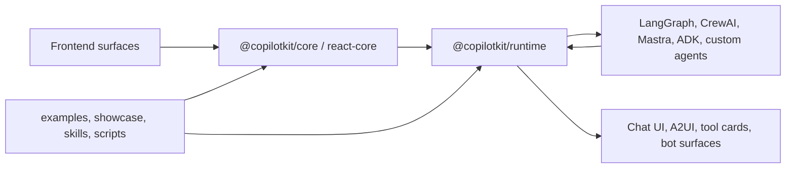

# CopilotKit Repository Notes

이 페이지는 [`nfbs2000/speaky-CopilotKit`](https://github.com/nfbs2000/speaky-CopilotKit) GitHub repository를 현재 공개 트리 그대로 설명하기 위한 GitHub Pages입니다. 특정 책의 해석이나 다른 프로젝트 적용 설계를 먼저 앞세우지 않고, GitHub의 README, package metadata, workspace 설정, 개발 문서, examples, showcase, skills를 기준으로 정리합니다.

## 짧은 답

이 리포는 CopilotKit의 제품 코드, 런타임, 프론트엔드 SDK, bot adapter, 예제, showcase 운영 도구, 개발 문서, AI coding agent용 skills를 한곳에 둔 Nx/pnpm monorepo입니다.

CopilotKit 자체는 단순한 chat UI 패키지가 아니라 frontend app, server runtime, agent framework, tool call, shared state, human-in-the-loop, generative UI를 AG-UI event stream으로 연결하는 agent-native application framework입니다. 이 리포는 그 프레임워크를 여러 표면과 여러 agent framework에서 실제로 빌드하고 검증하기 위한 전체 작업장입니다.

## 읽는 순서

| 묶음 | 먼저 볼 페이지 | 질문 |
| --- | --- | --- |
| 리포 전체 지도 | [1. 리포 지도](./repository-guide/01-repo-map.md) | 이 저장소는 어떤 단위로 나뉘는가 |
| 패키지 구조 | [2. 패키지 레이어](./repository-guide/02-package-layers.md) | `@copilotkit/*` 패키지는 어떤 계층으로 읽어야 하는가 |
| 서버/프로토콜 | [3. Runtime과 AG-UI](./repository-guide/03-runtime-agui.md) | frontend, runtime, agent framework는 어떤 event stream으로 연결되는가 |
| 프론트엔드 표면 | [4. Frontend와 Rendering](./repository-guide/04-frontend-rendering.md) | React/Angular/Vue/Native, A2UI, tool rendering은 어디에 놓이는가 |
| 채팅 플랫폼 | [5. Bot Surfaces](./repository-guide/05-bot-surfaces.md) | Slack, Teams, Discord, Telegram, WhatsApp adapter는 어떤 경계인가 |
| 실전 예제와 운영 | [6. Examples와 Showcase](./repository-guide/06-examples-showcase.md) | 48개 예제와 showcase platform은 무엇을 검증하는가 |
| AI coding agent 운영 | [7. Skills와 개발 운영](./repository-guide/07-skills-workflow.md) | `skills/`, `.claude/`, workflow 문서는 무엇을 담당하는가 |

## 리포 큰 덩어리

| 경로 | 현재 역할 |
| --- | --- |
| [`README.md`](https://github.com/nfbs2000/speaky-CopilotKit/blob/main/README.md) | CopilotKit을 agent-native application framework로 소개하는 공개 README입니다. |
| [`packages/`](https://github.com/nfbs2000/speaky-CopilotKit/tree/main/packages) | `@copilotkit/*`로 배포되는 core, runtime, React, Angular, Vue, React Native, bot, voice, renderer 패키지들이 들어 있습니다. |
| [`sdk-python/`](https://github.com/nfbs2000/speaky-CopilotKit/tree/main/sdk-python) | Python 쪽 CopilotKit SDK와 LangGraph/AG-UI 관련 테스트가 있는 영역입니다. |
| [`examples/`](https://github.com/nfbs2000/speaky-CopilotKit/tree/main/examples) | 통합 starter, canvas app, showcase app을 모은 예제 영역입니다. `examples/README.md` 기준으로 48개 consolidated demo를 다룹니다. |
| [`showcase/`](https://github.com/nfbs2000/speaky-CopilotKit/tree/main/showcase) | framework별 demo, shell, shell-docs, harness, Railway 배포/검증 스크립트를 묶은 showcase platform입니다. |
| [`skills/`](https://github.com/nfbs2000/speaky-CopilotKit/tree/main/skills) | Claude Code, Codex, Cursor 같은 coding agent에게 CopilotKit 작업법을 알려주는 `SKILL.md` 모음입니다. |
| [`dev-docs/`](https://github.com/nfbs2000/speaky-CopilotKit/tree/main/dev-docs) | architecture, setup, browser compatibility, bundle size 같은 개발자용 내부 설명 문서입니다. |
| [`.claude/`](https://github.com/nfbs2000/speaky-CopilotKit/tree/main/.claude) | 이 리포에서 agent가 따라야 하는 architecture, documentation, git, workflow 지침입니다. |
| [`.github/workflows/`](https://github.com/nfbs2000/speaky-CopilotKit/tree/main/.github/workflows) | release, static quality, unit test, showcase build/deploy/eval, plugin skills check를 담당하는 GitHub Actions입니다. |
| [`scripts/`](https://github.com/nfbs2000/speaky-CopilotKit/tree/main/scripts) | release, docs generation, plugin skill sync, QA, integration parity 검사를 위한 스크립트가 있습니다. |
| [`community/`](https://github.com/nfbs2000/speaky-CopilotKit/tree/main/community) | community demo와 contribution content template을 모아 둔 영역입니다. |

## 패키지 지도

| 묶음 | 패키지 |
| --- | --- |
| Core/runtime | `@copilotkit/core`, `@copilotkit/runtime`, `@copilotkit/runtime-client-gql`, `@copilotkit/shared`, `@copilotkit/sdk-js`, `@copilotkit/sqlite-runner`, `@copilotkit/agentcore-runner` |
| Web/mobile UI | `@copilotkit/react-core`, `@copilotkit/react-ui`, `@copilotkit/react-textarea`, `@copilotkit/react-native`, `@copilotkit/angular`, `@copilotkit/vue`, `@copilotkit/web-components`, `@copilotkit/web-inspector` |
| Generative UI / A2UI / voice | `@copilotkit/a2ui-renderer`, `@copilotkit/voice` |
| Bot surfaces | `@copilotkit/bot`, `@copilotkit/bot-ui`, `@copilotkit/bot-slack`, `@copilotkit/bot-teams`, `@copilotkit/bot-discord`, `@copilotkit/bot-telegram`, `@copilotkit/bot-whatsapp` |
| Repo tooling | `@copilotkit/demo-agents`, `tailwind-config`, `tsconfig`, `@copilotkit/typescript-config` |

루트 `package.json`은 이 전체를 Nx 작업으로 묶습니다. 주요 스크립트는 `build`, `build:examples`, `check-types`, `test`, `test:coverage`, `storybook`, `docs`, `check:plugin-skills`, `sync:plugin-skills`, `parity:check`입니다. `pnpm-workspace.yaml`은 `packages/*`, legacy/v2 examples, 일부 showcase app, showcase scripts/harness/eval webhook을 workspace에 포함합니다.

## Examples와 Showcase

`examples/README.md`는 예제 영역을 세 덩어리로 나눕니다.

| 영역 | 수 | 내용 |
| --- | ---: | --- |
| Integrations | 17 | LangGraph, Mastra, CrewAI, LlamaIndex, PydanticAI, Microsoft Agent Framework, Strands, MCP Apps, ADK, Agno 같은 agent framework starter입니다. |
| Canvas | 7 | visual card, shared state, human-in-the-loop 흐름을 가진 canvas app 예제입니다. |
| Showcases | 24 | banking, presentation, deep agents, generative UI, MCP apps, research canvas, kanban, CRM, spreadsheet 같은 완성형 demo app입니다. |

`showcase/README.md`는 이 예제들을 운영하는 플랫폼 쪽 문서입니다. `showcase/bin/showcase` CLI, framework별 `integrations/<slug>/`, `shell`, `shell-docs`, `shell-dashboard`, `harness`, `aimock`, `shared/`, registry generator, Railway 배포/승격 흐름이 여기에 정리되어 있습니다.

## Agent Skills

이 리포의 `skills/`는 제품 코드가 아니라 coding agent가 CopilotKit을 다룰 때 읽는 작업 지침입니다.

| Skill | 쓰임 |
| --- | --- |
| `copilotkit-setup` | 새 프로젝트에 CopilotKit을 설치하고 provider/runtime 기본 배선을 잡는 작업 |
| `copilotkit-develop` | CopilotKit v2 기능 개발, chat interface, frontend tool, shared context, interrupt 처리 |
| `copilotkit-agui` | AG-UI event, SSE transport, state sync, tool call, human-in-the-loop 흐름 이해 |
| `copilotkit-integrations` | LangGraph, CrewAI, PydanticAI, Mastra, ADK, LlamaIndex, Agno, Strands, Microsoft Agent Framework 등 외부 agent framework 연결 |
| `copilotkit-debug` | runtime 연결 실패, streaming 오류, tool execution 문제, version mismatch 진단 |
| `copilotkit-upgrade` | CopilotKit v1 application을 v2/AG-UI runtime 방식으로 이전 |
| `copilotkit-contribute` | 이 monorepo에 기여할 때의 개발/검증 흐름 |
| `copilotkit-self-update` | agent skills 자체를 최신 CopilotKit 지식으로 갱신 |
| `react-core`, `runtime`, `a2ui-renderer` | package별 더 좁은 작업 지침 |

`scripts/sync-plugin-skills.ts`는 package 내부 skill과 루트 `skills/` mirror가 어긋나지 않도록 검사하거나 동기화합니다.

## 이 리포가 할 수 있는 일

| 할 수 있는 일 | 근거 위치 |
| --- | --- |
| React, Angular, Vue, React Native, Web Component 표면에서 CopilotKit UI/runtime을 제공 | `packages/react-*`, `packages/angular`, `packages/vue`, `packages/web-components` |
| Express/Hono server runtime과 agent runner를 제공 | `packages/runtime` |
| AG-UI 기반 event stream, tool call, state update 흐름을 frontend와 runtime에 연결 | `packages/core`, `packages/runtime`, `dev-docs/architecture/ARCHITECTURE.md` |
| Slack, Teams, Discord, Telegram, WhatsApp 같은 chat platform adapter를 제공 | `packages/bot-*` |
| 여러 agent framework와의 starter/demo를 제공 | `examples/integrations`, `showcase/integrations` |
| Generative UI, A2UI, tool rendering, shared state, HITL demo를 제공 | `packages/a2ui-renderer`, `examples/showcases`, `showcase/integrations` |
| CopilotKit 작업을 위한 agent skill pack을 제공 | `skills/`, `.claude-plugin/`, `scripts/sync-plugin-skills.ts` |

## 이 리포가 아닌 것

| 아님 | 이유 |
| --- | --- |
| 하나의 애플리케이션 소스 | monorepo 안에 library package, runtime, demo, docs, release tooling이 함께 있습니다. |
| LLM provider 자체 | OpenAI, Anthropic, Gemini 같은 모델 provider를 호출할 수 있지만 provider 그 자체는 아닙니다. |
| AG-UI protocol의 유일한 upstream | README는 AG-UI와의 관계를 설명하지만, AG-UI protocol 자체는 별도 upstream인 `ag-ui-protocol/ag-ui`와 연결됩니다. |
| 단순 README 번역본 | 이 Pages는 현재 리포 구조를 읽기 위한 목차입니다. 상세 API 설명은 공식 docs와 source를 따라가야 합니다. |

## 기존 Source Notes

아래 7개 문서는 기존 GitHub Pages에 있던 CopilotKit source reading note입니다. 첫 화면은 리포 전체 지도로 바꾸었지만, 심화 해석 문서는 그대로 남겨 둡니다.

| 장 | 질문 |
| --- | --- |
| [1. 소개](./copilotkit-source/01-introduction.md) | CopilotKit을 왜 chat UI가 아니라 AG-UI 기반 application runtime으로 봐야 하는가 |
| [2. Monorepo 지도](./copilotkit-source/02-monorepo-map.md) | 실제 repo에서 core, runtime, React, A2UI, AG-UI 문서는 어디에 있는가 |
| [3. 통제 경계](./copilotkit-source/03-control-boundary.md) | 모델이 CopilotKit을 통제하는가, CopilotKit이 모델을 통제하는가 |
| [4. Core와 Runtime 코드 경로](./copilotkit-source/04-core-runtime-codepath.md) | `CopilotKitProvider`에서 `RunHandler`, runtime SSE까지 실제 호출 경로는 어떻게 이어지는가 |
| [5. AG-UI 이벤트 모델](./copilotkit-source/05-ag-ui-event-model.md) | CopilotKit을 AG-UI 관점에서 보면 tool, state, activity, message가 어떻게 흘러가는가 |
| [6. UI Tools와 A2UI](./copilotkit-source/06-ui-tools-a2ui-rendering.md) | `useFrontendTool`, `useRenderTool`, HITL, A2UI renderer는 어떤 경계를 가진가 |
| [7. Mothership 적용 설계](./copilotkit-source/07-mothership-application-layer.md) | application protocol 위에 CopilotKit/AG-UI를 어떻게 붙여야 하는가 |

## Source Snapshot

| 항목 | 값 |
| --- | --- |
| Repository | [`nfbs2000/speaky-CopilotKit`](https://github.com/nfbs2000/speaky-CopilotKit) |
| Product source snapshot | [`main@5c50d9c51`](https://github.com/nfbs2000/speaky-CopilotKit/tree/5c50d9c51) |
| Pages source branch | [`codex/copilotkit-source-pages`](https://github.com/nfbs2000/speaky-CopilotKit/tree/codex/copilotkit-source-pages/site) |
| Public URL | <https://nfbs2000.github.io/speaky-CopilotKit/> |
