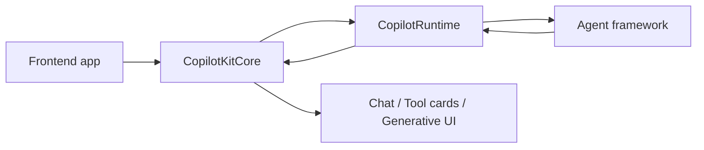

# CopilotKit Source Notes

이 문서는 `/Users/realpio4/Documents/speaky-CopilotKit` source를 기준으로 CopilotKit을 다시 읽기 위한 GitHub Pages입니다.

`book-copilotkit-ko`의 관점은 유지합니다. 다만 이 Pages는 책 원고를 그대로 옮기지 않습니다. 실제 `speaky-CopilotKit` monorepo의 package, runtime, hook, skill, example을 근거로 공개 문서를 다시 씁니다.

## 핵심 결론

CopilotKit은 “앱에 붙이는 챗봇 UI”가 아닙니다.

CopilotKit은 frontend app, server runtime, agent framework를 AG-UI event stream으로 연결하고, 앱의 context, tools, state, renderer, human decision을 agent loop에 노출하는 agent-native application framework입니다.



## 읽는 순서

| 장 | 질문 |
| --- | --- |
| [1. 소개](./copilotkit-source/01-introduction.md) | CopilotKit을 왜 챗봇 UI가 아니라 agent-native runtime으로 봐야 하는가 |
| [2. Monorepo 지도](./copilotkit-source/02-monorepo-map.md) | 실제 repo에서 core, runtime, frontend, AG-UI, examples는 어디에 있는가 |
| [3. 통제 경계](./copilotkit-source/03-control-boundary.md) | 모델이 CopilotKit을 통제하는가, CopilotKit이 모델을 통제하는가 |

## Source Snapshot

```text
nfbs2000/speaky-CopilotKit @ 5c50d9c51
```

## 작성 원칙

1. 설명은 한국어로 씁니다.
2. package name, API name, event name은 원문 그대로 둡니다.
3. 모든 큰 주장은 실제 source path로 연결합니다.
4. `book-copilotkit-ko`는 해석의 관점으로만 사용하고, 공개 Pages의 근거는 `speaky-CopilotKit` source로 둡니다.
5. CopilotKit을 Mothership에 연결할 때는 runtime owner가 아니라 UI/protocol adapter로 읽습니다.
