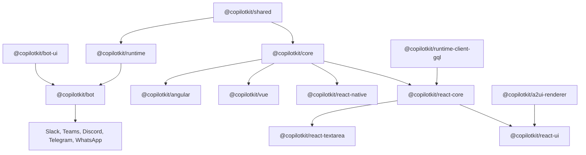

# 2. 패키지 레이어

[`packages/`](https://github.com/nfbs2000/speaky-CopilotKit/tree/main/packages)는 CopilotKit monorepo의 배포 단위가 모인 영역이다. 모든 패키지를 같은 무게로 읽으면 구조가 흐려진다. 먼저 core/runtime, frontend surface, rendering, bot surface, tooling으로 나눠야 한다.

## 계층 지도

## Core와 runtime

| Package | 역할 |
| --- | --- |
| [`@copilotkit/core`](https://github.com/nfbs2000/speaky-CopilotKit/tree/main/packages/core) | framework에 덜 묶인 web core. agent 연결, context, tool, run orchestration의 기반으로 읽는다. |
| [`@copilotkit/runtime`](https://github.com/nfbs2000/speaky-CopilotKit/tree/main/packages/runtime) | server runtime. frontend 요청을 받고 agent runner와 연결한 뒤 event stream을 돌려주는 층이다. |
| [`@copilotkit/runtime-client-gql`](https://github.com/nfbs2000/speaky-CopilotKit/tree/main/packages/runtime-client-gql) | legacy/runtime client 쪽 GraphQL 통신 경계다. |
| [`@copilotkit/shared`](https://github.com/nfbs2000/speaky-CopilotKit/tree/main/packages/shared) | 여러 package가 공유하는 type, utility, constant 성격의 기반이다. |
| [`@copilotkit/sdk-js`](https://github.com/nfbs2000/speaky-CopilotKit/tree/main/packages/sdk-js) | JavaScript SDK 성격의 package다. |
| [`@copilotkit/sqlite-runner`](https://github.com/nfbs2000/speaky-CopilotKit/tree/main/packages/sqlite-runner) | SQLite-backed agent runner다. |
| [`@copilotkit/agentcore-runner`](https://github.com/nfbs2000/speaky-CopilotKit/tree/main/packages/agentcore-runner) | AWS Bedrock AgentCore-compatible runner다. |

## Frontend surface

| Package | 역할 |
| --- | --- |
| [`@copilotkit/react-core`](https://github.com/nfbs2000/speaky-CopilotKit/tree/main/packages/react-core) | React provider와 hooks의 핵심. `useCopilotChat`, frontend action/tool, state sharing, HITL 흐름을 읽는 출발점이다. |
| [`@copilotkit/react-ui`](https://github.com/nfbs2000/speaky-CopilotKit/tree/main/packages/react-ui) | React prebuilt UI. chat, popup, sidebar 같은 사용자 표면을 담당한다. |
| [`@copilotkit/react-textarea`](https://github.com/nfbs2000/speaky-CopilotKit/tree/main/packages/react-textarea) | AI assisted text editing surface다. |
| [`@copilotkit/react-native`](https://github.com/nfbs2000/speaky-CopilotKit/tree/main/packages/react-native) | React Native surface다. |
| [`@copilotkit/angular`](https://github.com/nfbs2000/speaky-CopilotKit/tree/main/packages/angular) | Angular integration이다. |
| [`@copilotkit/vue`](https://github.com/nfbs2000/speaky-CopilotKit/tree/main/packages/vue) | Vue 3 components와 composables를 제공한다. |
| [`@copilotkit/web-components`](https://github.com/nfbs2000/speaky-CopilotKit/tree/main/packages/web-components) | framework-agnostic shadow DOM web components다. |
| [`@copilotkit/web-inspector`](https://github.com/nfbs2000/speaky-CopilotKit/tree/main/packages/web-inspector) | CopilotKit web inspector component다. |

## Rendering과 multimodal surface

| Package | 역할 |
| --- | --- |
| [`@copilotkit/a2ui-renderer`](https://github.com/nfbs2000/speaky-CopilotKit/tree/main/packages/a2ui-renderer) | A2UI surface를 React application 안에서 render하는 package다. |
| [`@copilotkit/voice`](https://github.com/nfbs2000/speaky-CopilotKit/tree/main/packages/voice) | transcription, text-to-speech 같은 voice service 경계다. |

## Bot surface

| Package | 역할 |
| --- | --- |
| [`@copilotkit/bot`](https://github.com/nfbs2000/speaky-CopilotKit/tree/main/packages/bot) | platform-agnostic bot engine. incoming message, agent run, tool, interrupt, JSX action binding, `PlatformAdapter` contract를 담당한다. |
| [`@copilotkit/bot-ui`](https://github.com/nfbs2000/speaky-CopilotKit/tree/main/packages/bot-ui) | JSX runtime, IR, cross-platform component vocabulary다. |
| [`@copilotkit/bot-slack`](https://github.com/nfbs2000/speaky-CopilotKit/tree/main/packages/bot-slack) | Slack `PlatformAdapter`. Bolt/Socket Mode, Block Kit rendering, streaming, interactions, HITL을 Slack으로 연결한다. |
| [`@copilotkit/bot-teams`](https://github.com/nfbs2000/speaky-CopilotKit/tree/main/packages/bot-teams) | Microsoft Teams adapter다. |
| [`@copilotkit/bot-discord`](https://github.com/nfbs2000/speaky-CopilotKit/tree/main/packages/bot-discord) | Discord adapter다. |
| [`@copilotkit/bot-telegram`](https://github.com/nfbs2000/speaky-CopilotKit/tree/main/packages/bot-telegram) | Telegram adapter다. |
| [`@copilotkit/bot-whatsapp`](https://github.com/nfbs2000/speaky-CopilotKit/tree/main/packages/bot-whatsapp) | WhatsApp Cloud API adapter다. |

## Tooling package

| Package | 역할 |
| --- | --- |
| [`@copilotkit/demo-agents`](https://github.com/nfbs2000/speaky-CopilotKit/tree/main/packages/demo-agents) | demo agent package다. |
| [`tailwind-config`](https://github.com/nfbs2000/speaky-CopilotKit/tree/main/packages/tailwind-config) | shared Tailwind config다. |
| [`tsconfig`](https://github.com/nfbs2000/speaky-CopilotKit/tree/main/packages/tsconfig) | shared TypeScript config다. |
| [`@copilotkit/typescript-config`](https://github.com/nfbs2000/speaky-CopilotKit/tree/main/packages/typescript-config) | TypeScript config package다. |

## 읽을 때의 기준

패키지 이름이 많지만 핵심 질문은 세 개다.

1. App developer가 직접 쓰는 surface인가: `react-core`, `react-ui`, `angular`, `vue`, `react-native`, `web-components`
2. Agent와 통신하는 runtime인가: `core`, `runtime`, `runtime-client-gql`, runner packages
3. UI를 다른 표면으로 투영하는 adapter인가: `a2ui-renderer`, `bot`, `bot-ui`, `bot-*`

## Takeaway

CopilotKit의 크기는 패키지 수 때문만이 아니다. 같은 agent loop를 web app, native app, chat platform, generative UI, showcase demo로 투영하는 경계가 많기 때문에 크다. 그래서 package를 “폴더 목록”이 아니라 “surface와 runtime의 계층”으로 읽어야 한다.
