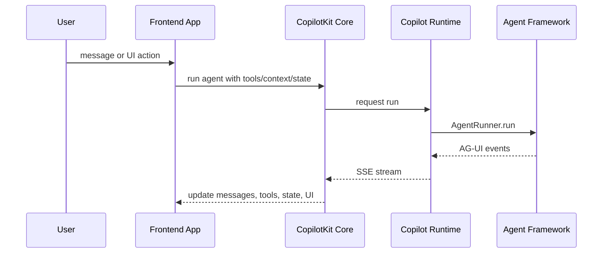

# 3. Runtime과 AG-UI

CopilotKit의 중심은 frontend component가 아니라 frontend, server runtime, agent framework 사이의 run loop다. 이 run loop는 AG-UI event stream을 기준으로 읽어야 한다.

## 3계층

[`dev-docs/architecture/ARCHITECTURE.md`](https://github.com/nfbs2000/speaky-CopilotKit/blob/main/dev-docs/architecture/ARCHITECTURE.md)는 CopilotKit을 세 계층으로 설명한다.

| 계층 | 위치 | 역할 |
| --- | --- | --- |
| Frontend | React, Angular, Vue, Vanilla, React Native | provider, hooks, context, tools, UI rendering을 등록한다. |
| Runtime | `@copilotkit/runtime` | frontend 요청을 받고 agent runner를 실행하며 event stream을 돌려준다. |
| Agent | LangGraph, CrewAI, Mastra, PydanticAI, custom agent 등 | AG-UI protocol을 말하는 agent implementation이다. |

## AG-UI가 하는 일

AG-UI는 agent와 UI 사이의 event contract로 읽는다. 중요한 점은 “model text”만 흐르는 것이 아니라 lifecycle, text, tool call, tool result, state update, interrupt 같은 event가 같이 흐른다는 것이다.

| Event 성격 | 의미 |
| --- | --- |
| Lifecycle | run 시작/종료, step 시작/종료 같은 실행 상태 |
| Text | assistant message streaming |
| Tool call | agent가 tool을 호출하겠다는 선언과 arguments |
| Tool result | frontend/runtime 쪽 tool 실행 결과 |
| State | agent와 UI가 공유하는 상태 snapshot/delta |
| HITL | 사람이 승인하거나 값을 넣어야 하는 interrupt/response |

## Runtime은 무엇을 소유하는가

[`@copilotkit/runtime`](https://github.com/nfbs2000/speaky-CopilotKit/tree/main/packages/runtime)은 server boundary다. Runtime은 agent의 두뇌가 아니라 agent run을 앱의 transport와 연결하는 실행층이다.

| 책임 | 설명 |
| --- | --- |
| Endpoint | frontend에서 들어오는 run 요청을 받는다. |
| Agent registry | 어떤 agent id가 어떤 runner와 연결되는지 관리한다. |
| Event streaming | agent event를 frontend가 받을 수 있는 stream으로 전달한다. |
| Tool bridge | frontend tool call과 result를 agent loop로 되돌린다. |
| Middleware/runner boundary | built-in agent, external agent, framework integration을 runtime 계약에 맞춘다. |

## Frontend tool과 runtime tool의 경계

CopilotKit에서 tool은 전부 server에만 있는 것이 아니다. UI가 가진 상태나 브라우저에서만 가능한 작업은 frontend tool로 등록될 수 있다. Agent는 tool call을 선택하고, CopilotKit은 해당 tool call이 frontend 쪽 handler로 실행되도록 연결한 뒤 result를 다시 agent에게 observation으로 돌려준다.

이 구조 때문에 CopilotKit은 단순 chat UI가 아니다. UI component와 agent가 같은 상태와 tool result를 기준으로 상호작용하는 application loop다.

## Framework integration의 의미

[`examples/integrations`](https://github.com/nfbs2000/speaky-CopilotKit/tree/main/examples/integrations)와 [`showcase/integrations`](https://github.com/nfbs2000/speaky-CopilotKit/tree/main/showcase/integrations)는 runtime이 특정 agent framework 하나에 고정되지 않는다는 것을 보여 준다.

| Framework 계열 | 읽을 위치 |
| --- | --- |
| LangGraph | `examples/integrations/langgraph-*`, `showcase/integrations/langgraph-*` |
| CrewAI | `examples/integrations/crewai-*`, `showcase/integrations/crewai-*` |
| Mastra | `examples/integrations/mastra`, `showcase/integrations/mastra` |
| LlamaIndex | `examples/integrations/llamaindex`, `showcase/integrations/llamaindex` |
| PydanticAI | `examples/integrations/pydantic-ai`, `showcase/integrations/pydantic-ai` |
| Microsoft Agent Framework | `examples/integrations/ms-agent-framework-*`, `showcase/integrations/ms-agent-*` |
| Strands, ADK, Agno, MCP Apps | corresponding integration folders |

## Takeaway

CopilotKit runtime은 LLM provider wrapper가 아니다. App surface와 agent framework 사이에 있는 run/event/tool/state bridge다. CopilotKit을 제대로 소개하려면 UI package보다 이 runtime/AG-UI 경계를 먼저 잡아야 한다.
